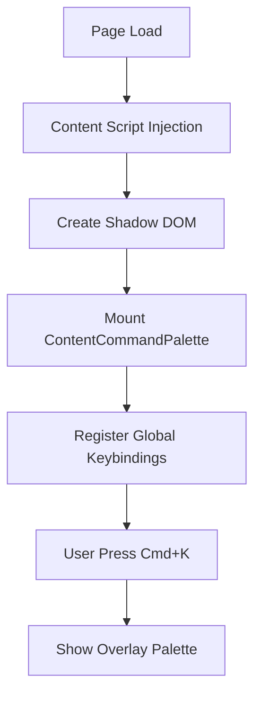
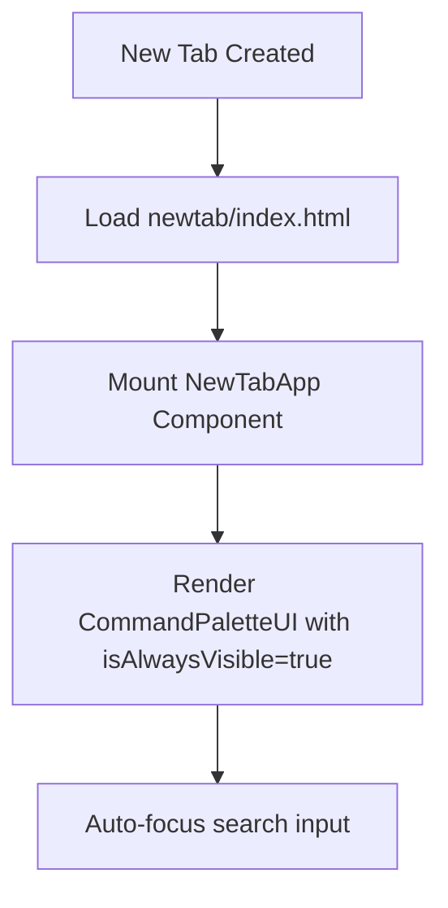

# CLAUDE.md

This file provides comprehensive guidance to Claude Code (claude.ai/code) when working with the Monocle browser extension codebase.

## Project Overview

Monocle is a browser extension built with Extension.js that provides a command palette interface (similar to VS Code's Command Palette or macOS Spotlight) for browser operations. The extension features dual deployment modes: an overlay command palette that appears on any webpage, and a dedicated new tab page for extended use.

### Key Features
- **Dual Interface Modes**: Overlay on any webpage + dedicated new tab page
- Command palette UI with fuzzy search (powered by CMDK)
- Categorized commands (favorites, recents, suggestions)
- **Deep Search**: Search deeply nested commands without navigation (e.g., bookmark hierarchies)
- Keyboard shortcuts for common actions
- Cross-browser compatibility (Chrome/Chromium and Firefox)
- Dynamic command generation based on current browser state
- UI forms for commands requiring user input
- Shadow DOM isolation to prevent style conflicts with host pages
- **Shared Component Architecture**: Reusable components across different contexts

## Architecture Overview

### Core Components

```
bifocal/
├── background/          # Background script (service worker/persistent script)
│   ├── index.ts        # Entry point - initializes keybindings and message handlers
│   ├── commands/       # Command definitions and management
│   ├── messages/       # Message handlers for content/newtab communication
│   ├── getCommands.ts              # Main command fetching with deep search
│   └── getDeepSearchCommands.ts    # Deep search flattening logic
│   ├── keybindings/    # Keybinding registry and matching logic
│   └── utils/          # Browser API wrappers and utilities
├── content/            # Content script (injected into web pages)
│   ├── scripts.tsx     # Entry point - creates shadow DOM and mounts React UI
│   ├── components/     # Content-specific React components
│   └── hooks/          # Content-specific React hooks
├── newtab/             # New tab page implementation
│   ├── index.html      # New tab HTML entry point
│   ├── scripts.tsx     # New tab React entry point
│   ├── NewTabApp.tsx   # Main new tab application component
│   ├── components/     # New tab-specific React components
│   │   └── NewTabCommandPalette.tsx # New tab command palette wrapper
│   └── styles.css      # New tab specific styles
├── shared/             # Shared components and utilities
│   ├── components/     # Reusable React components
│   │   ├── CommandPaletteUI.tsx      # Main palette component (configurable)
│   │   ├── ContentCommandPalette.tsx # Content script wrapper
│   │   ├── command/    # Individual command palette sub-components
│   │   │   ├── CommandPalette.tsx    # Core CMDK palette
│   │   │   ├── CommandItem.tsx       # Individual command display
│   │   │   ├── CommandActions.tsx    # Command modifier actions
│   │   │   ├── CommandHeader.tsx     # Search input
│   │   │   ├── CommandFooter.tsx     # Keybinding hints
│   │   │   ├── CommandList.tsx       # Command list container
│   │   │   ├── CommandName.tsx       # Command name with breadcrumbs
│   │   │   └── DeepSearchItems.tsx   # Deep search result display
│   │   ├── commandUI.tsx # Form UI for commands requiring input
│   │   └── icon.tsx      # Icon component with Lucide support
│   ├── hooks/          # Reusable React hooks
│   │   ├── useGetCommands.tsx        # Command fetching and caching
│   │   ├── useSendMessage.tsx        # Background script messaging
│   │   ├── useCommandNavigation.tsx  # Redux-based navigation with command pages
│   │   ├── useActionLabel.tsx        # Dynamic action labeling
│   │   └── useCopyToClipboard.tsx    # Clipboard utilities
│   ├── store/          # Redux Toolkit store configuration
│   │   ├── index.ts    # Store factory and type exports
│   │   ├── hooks.ts    # Typed Redux hooks (useAppDispatch, useAppSelector)
│   │   └── slices/     # Redux slices
│   │       └── navigation.slice.ts   # Navigation state management slice
│   └── types/          # Shared TypeScript type definitions
└── types.ts            # Global TypeScript definitions
```

## Data Flow Architecture

### 1. Dual-Mode Architecture

The extension now supports two distinct operational modes:

#### Content Script Mode (Overlay)


#### New Tab Mode (Standalone)


### 2. Shared Component Architecture

Both modes utilize the same core components through the shared architecture:

```
ContentCommandPalette ──┐
                        ├──> CommandPalette (CMDK)
NewTabCommandPalette ───┘    └─> Command Sub-components
```

### 3. Command Execution Flow

1. **User Interaction**: User opens palette (Cmd+K on pages, always visible on new tab) and selects a command
2. **UI Layer**: Either `ContentCommandPalette` or `CommandPaletteUI` sends `execute-command` message
3. **Background Script**: 
   - Receives message via runtime messaging API
   - Finds command in registry
   - Executes command's `run()` function
   - Updates usage statistics (recents, favorites)
4. **Browser Action**: Command performs browser API calls (open tab, close window, etc.)
5. **UI Feedback**: 
   - Content mode: Closes palette overlay
   - New tab mode: Stays open (configurable with `isAlwaysVisible`)

### 4. Message Flow Between Components

```
Content Script (ContentCommandPalette) ─┐
                                        ├─> Background Script (Logic)
New Tab (CommandPaletteUI) ─────────────┘      │
     |                                         ├─ getCommands()
     ├─ get-commands ─────────────────────────> ├─ executeCommand()
     ├─ execute-command ──────────────────────> ├─ getChildrenCommands()
     ├─ get-children-commands ────────────────> └─ executeKeybinding()
     └─ execute-keybinding ───────────────────>
```

## Command System

### Command Types

The extension supports three types of commands, all extending `BaseCommand`:

#### 1. RunCommand
Simple executable commands with a `run()` function.
```typescript
interface RunCommand extends BaseCommand {
  run: (context?: Browser.Context, values?: Record<string, string>) => void | Promise<void>;
  actionLabel?: string;
  modifierActionLabel?: { [key in ModifierKey]?: string };
}
```
Example: `closeCurrentTab`, `openNewWindow`

#### 2. ParentCommand
Commands that generate child commands dynamically.
```typescript
interface ParentCommand extends BaseCommand {
  commands: (context: Browser.Context) => Promise<Command[]>;
  enableDeepSearch?: boolean; // Optional: enables deep search for nested commands
}
```
Example: `gotoTab` generates a list of all open tabs as child commands
**Deep Search**: When `enableDeepSearch: true`, nested commands become searchable from the top level

#### 3. UICommand
Commands that require user input via form fields.
```typescript
interface UICommand extends BaseCommand {
  ui: CommandUI[];
  run: (context?: Browser.Context, values?: Record<string, string>) => void | Promise<void>;
}
```
Example: `googleSearch` shows an input field for the search query

### Command Data Structure

#### BaseCommand Properties
- `id`: Unique identifier
- `name`: Display name (can be string, array for breadcrumbs, or async function)
- `description`: Optional description
- `icon`: Icon configuration (Lucide icon name or custom URL)
- `color`: Theme color for the command
- `keywords`: Search keywords for fuzzy matching
- `priority`: Function to determine command priority
- `supportedBrowsers`: Array of supported browsers (`["chrome", "firefox"]`)
- `actions`: Sub-actions available for the command
- `keybinding`: Keyboard shortcut (e.g., "⌘ K", "⌃ d")
- `doNotAddToRecents`: Flag to exclude from recent commands

### NoOp Commands

NoOp (No Operation) commands are special display-only commands used for error states, empty states, and informational messages. They provide better UX than alerts for ParentCommand error conditions.

**Creation Utility**:
```typescript
// background/utils/commands.ts
createNoOpCommand(
  id: string,
  name: string, 
  description: string,
  icon?: CommandIcon
): Command
```

**Usage Pattern**:
```typescript
// In ParentCommand error handling
commands: async () => {
  try {
    const data = await fetchData()
    return processData(data)
  } catch (error) {
    return [
      createNoOpCommand(
        "fetch-error",
        "Unable to Load Data", 
        "Please check your connection and try again",
        { type: "lucide", name: "AlertTriangle" }
      )
    ]
  }
}
```

**When to Use NoOp vs Alerts**:
- **NoOp Commands**: Error states in ParentCommands, empty states, loading states
- **Alerts**: Success messages, action confirmations, RunCommand/UICommand errors

### Command Organization

Commands are organized into three categories:

1. **Favorites**: User-favorited commands for quick access
2. **Recents**: Recently executed commands (auto-tracked)
3. **Suggestions**: All other available commands, ranked by usage frequency
4. **Deep Search Items**: Flattened nested commands from ParentCommands with `enableDeepSearch: true`

### Favorites System

The favorites system allows users to star commands for quick access and supports complex nested command hierarchies.

#### Architecture

**Storage**: Persistent storage using `chrome.storage.local` with key `monocle-favoriteCommandIds`

**Format**: Array of command IDs (strings) that persist across browser sessions

**Recursive Discovery**: The `findFavoritedCommands()` function (lines 76-131 in `background/commands/index.ts`) recursively searches through ParentCommand hierarchies to find favorited nested commands.

```typescript
const findFavoritedCommands = async (
  commands: Command[],
  favoriteCommandIds: string[],
  context: Browser.Context,
  parentName?: string,
): Promise<Command[]>
```

**Key Features**:
- **Breadcrumb Names**: Favorited sub-commands show parent context: `[childName, parentName]`
- **Context Preservation**: Maintains execution context for nested commands
- **Error Resilience**: Graceful handling of command resolution failures
- **Cross-Mode Support**: Available in both content script and new tab modes

#### Operations
- `addToFavoriteCommandIds(commandId)`: Add command to favorites
- `removeFromFavoriteCommandIds(commandId)`: Remove from favorites
- `toggleFavoriteCommandId(commandId)`: Toggle favorite status
- `getFavoriteCommandIds()`: Retrieve all favorite command IDs
- `isCommandFavorite(commandId)`: Check if command is favorited

#### Auto-Generated Actions
Every command automatically receives a toggle favorite action in its action menu:
- **Icon**: Star (filled) for favorited commands, Star (outline) for non-favorited
- **Label**: "Remove from Favorites" or "Add to Favorites"
- **Behavior**: Instantly updates favorite status without closing the palette

### Command Registration Flow

```typescript
// background/commands/index.ts
getCommands() {
  1. Load all command modules (browser, tools, etc.)
  2. Filter by browser compatibility
  3. Recursively discover favorited commands (including nested ones)
  4. Organize into favorites/recents/suggestions
  5. Process deep search commands (flatten nested hierarchies)
  6. Apply usage-based ranking
  7. Convert to CommandSuggestion format for UI
  8. Return {favorites, recents, suggestions, deepSearchItems}
}
```

## Deep Search Feature

The deep search feature allows users to search for deeply nested commands directly from the top level without navigating through parent command hierarchies. This dramatically improves the user experience for complex command trees like bookmarks.

### Architecture

**Single Request Pattern**: Deep search items are pre-processed during the initial `getCommands()` call and returned alongside regular commands:

```typescript
// Response structure
{
  favorites: CommandSuggestion[],
  recents: CommandSuggestion[],  
  suggestions: CommandSuggestion[],
  deepSearchItems: CommandSuggestion[] // Pre-flattened nested commands
}
```

**Background Processing**: The `flattenDeepSearchCommands()` function recursively walks command trees:
1. Scans for ParentCommands with `enableDeepSearch: true`
2. Recursively processes all nested child commands
3. Enhances each command with breadcrumb names (e.g., `["React Docs", "GitHub", "Development", "Bookmarks"]`)
4. Expands keywords to include all folder names in the hierarchy
5. Preserves all original command properties (actions, icons, keybindings)

### Usage Example

```typescript
// Enable deep search on a ParentCommand
export const bookmarks: ParentCommand = {
  id: "bookmarks",
  name: "Bookmarks",
  enableDeepSearch: true, // This enables the feature
  commands: async () => {
    // Returns nested bookmark hierarchy
    return processBookmarkTree(await getBookmarkTree())
  }
}
```

### User Experience Benefits

- **Instant Results**: Deep search items appear immediately when typing (pre-loaded, no API calls)
- **Enhanced Search**: Users can search by folder names, URLs, and all nested content
- **Full Feature Parity**: Deep search items support action menus, modifier keys, and all standard command features
- **Breadcrumb Navigation**: Clear visual hierarchy showing the command's location

### Performance Characteristics

- **Single Processing Pass**: Command trees are flattened once during `getCommands()`
- **Memory Trade-off**: Uses more memory to store flattened commands for instant search response
- **No Flickering**: Eliminates the previous dual-request pattern that caused UI flickering
- **Cached Results**: Deep search items are cached with other command data

### Technical Implementation

**Key Files**:
- `background/messages/getDeepSearchCommands.ts`: Core flattening logic
- `shared/components/Command/DeepSearchItems.tsx`: UI component for rendering results
- `shared/hooks/useCommandNavigation.tsx`: Integration with command selection

**Integration Points**:
- Deep search items are included in focused command lookup for action menus
- CMDK fuzzy search works across all enhanced keywords
- Command execution flow handles deep search items identically to regular commands

## Messaging System

### Message Types

```typescript
type Message = 
  | ExecuteCommandMessage     // Execute a specific command
  | GetCommandsMessage        // Fetch all available commands
  | GetChildrenMessage        // Get child commands for a parent
  | ExecuteKeybindingMessage; // Execute command by keybinding
```

### Browser.Context

Every command execution includes context about the current page:

```typescript
interface Browser.Context {
  url: string;        // Current page URL
  title: string;      // Current page title
  modifierKey: ModifierKey | null; // Active modifier key
}
```

### Message Handler Architecture

```typescript
// background/messages/index.ts
handleMessage(message) {
  return await match(message)
    .with({ type: "get-commands" }, async (msg) => {
      // Returns {favorites, recents, suggestions, deepSearchItems}
    })
    .with({ type: "execute-command" }, async (msg) => {
      // Finds and executes command, updates usage stats
    })
    .with({ type: "get-children-commands" }, async (msg) => {
      // Returns child commands for ParentCommand
    })
    .with({ type: "execute-keybinding" }, async (msg) => {
      // Maps keybinding to command and executes
    })
    .otherwise(() => {
      throw new Error(`Unknown message type: ${(message as any).type}`);
    });
}
```

## UI Components Architecture

### Shared Component System

The new architecture uses a shared component system that supports both overlay and standalone modes:

#### Core Components
1. **CommandPalette**: Core CMDK-based palette component
   - Shared by both usage modes
   - Handles search, filtering, and command execution
   - Manages keyboard navigation
   - Location: `/shared/components/Command/CommandPalette.tsx`

2. **ContentCommandPalette**: Content script wrapper
   - Uses `useCommandPaletteState` for overlay show/hide logic
   - Integrates with global keybindings
   - Handles shadow DOM rendering
   - Location: `/content/components/ContentCommandPalette.tsx`

3. **NewTabCommandPalette**: New tab page wrapper
   - Uses `useGetCommands` and `useGlobalKeybindings` hooks
   - Handles command execution and auto-focus
   - Always-visible behavior for new tab mode
   - Location: `/newtab/components/NewTabCommandPalette.tsx`

#### Component Hierarchy

```
┌─ ContentCommandPalette (Content Script) ─┐    ┌─ NewTabCommandPalette (New Tab) ─┐
│  ├── useCommandPaletteState              │    │  ├── useGetCommands               │
│  └── CommandPalette                      │    │  ├── useGlobalKeybindings         │
│      (CMDK-based palette)                │    │  └── CommandPalette               │
└───────────────────────────────────────────┘    │      (CMDK-based palette)         │
                          │                      └─────────────────────────────────────┘
                          └──────── CommandPalette Sub-components ─────────┘
                                   ├── CommandHeader (search input)
                                   ├── CommandList (scrollable list)
                                   │   └── CommandItem (individual command)
                                   │       ├── CommandName (with breadcrumbs)
                                   │       └── CommandActions (modifier actions)
                                   └── CommandFooter (keybinding hints)
```

### Shadow DOM Isolation (Content Script Only)

Content script mode uses Shadow DOM to prevent style conflicts:
- Content script creates a shadow root
- Styles are injected into shadow DOM via fetch
- React app is mounted inside shadow root
- Complete isolation from host page styles
- **New tab mode uses regular DOM** (no shadow DOM needed)

### State Management

The application uses Redux Toolkit for command palette state management, providing predictable state updates and improved developer experience.

#### Redux Store Architecture

The Redux store is created dynamically per instance and manages navigation state across both content script and new tab modes:

**Store Configuration** (`/shared/store/index.ts`):
```typescript
export const createNavigationStore = (
  initialCommands: {
    favorites: CommandSuggestion[]
    recents: CommandSuggestion[]
    suggestions: CommandSuggestion[]
    deepSearchItems: CommandSuggestion[]
  },
  sendMessage: (message: any) => Promise<any>,
) => {
  return configureStore({
    reducer: {
      navigation: navigationSlice.reducer,
    },
    middleware: (getDefaultMiddleware) =>
      getDefaultMiddleware({
        thunk: {
          extraArgument: { sendMessage } as ThunkApi,
        },
      }),
    preloadedState: {
      navigation: getInitialStateWithCommands(initialCommands),
    },
  })
}
```

**Key Features**:
- **Dynamic Store Creation**: Each mode (content script/new tab) creates its own store instance
- **Message Injection**: Background script messaging function injected as thunk extra argument
- **Preloaded State**: Initial commands from background script loaded into store on creation
- **Type Safety**: Full TypeScript support with typed hooks and selectors

#### Navigation Slice (`/shared/store/slices/navigation.slice.ts`)

The navigation slice manages the command palette's hierarchical navigation state:

**State Shape**:
```typescript
interface NavigationState {
  pages: Page[]                    // Stack of command pages (navigation history)
  ui: UI | null                   // Active UI form for input commands
  initialCommands: {              // Root commands and deep search items
    favorites: CommandSuggestion[]
    recents: CommandSuggestion[]
    suggestions: CommandSuggestion[]
    deepSearchItems: CommandSuggestion[]
  }
  loading: boolean                // Async operation loading state
  error: string | null           // Error state for failed operations
}

type Page = {
  id: string                     // Command ID or "root"
  commands: {                    // Commands available on this page
    favorites: CommandSuggestion[]
    recents: CommandSuggestion[]
    suggestions: CommandSuggestion[]
  }
  searchValue: string           // Current search input
  parent?: CommandSuggestion    // Reference to parent command
  parentPath: string[]          // Path of parent command IDs for efficient lookups
}
```

**Async Thunks**:
- `navigateToCommand`: Navigate to a ParentCommand's children, creates new page in navigation stack
- `refreshCurrentPage`: Refresh commands for the current page (child pages only)

**Synchronous Actions**:
- `setInitialCommands`: Update root page commands (favorites/recents updates)
- `updateSearchValue`: Update search input for current page
- `navigateBack`: Pop current page or close UI form
- `showUI`/`hideUI`: Display/hide UI forms for input commands
- `clearError`: Clear error state

**Selectors** (co-located with slice):
- `selectCurrentPage`: Get the active page (last in navigation stack)
- `selectPages`: Get full navigation stack
- `selectUI`: Get active UI form
- `selectInitialCommands`: Get root commands and deep search items
- `selectLoading`/`selectError`: Get async operation state

#### Typed Redux Hooks (`/shared/store/hooks.ts`)

Type-safe Redux hooks for use throughout the application:

```typescript
export const useAppDispatch = useDispatch.withTypes<AppDispatch>()
export const useAppSelector = useSelector.withTypes<RootState>()
export const useAppStore = useStore.withTypes<AppStore>()
```

**Usage Pattern**:
```typescript
// In components
const dispatch = useAppDispatch()
const currentPage = useAppSelector(selectCurrentPage)
const loading = useAppSelector(selectLoading)

// Dispatch actions
dispatch(updateSearchValue("new search"))
dispatch(navigateToCommand({ id: "command-id", currentPage, initialCommands }))
```

#### Integration with Command Palette

**Provider Setup**: Both content script and new tab modes wrap their command palettes with Redux providers:

```typescript
// ContentCommandPalette.tsx & NewTabCommandPalette.tsx
const store = useMemo(() => {
  if (!data) return null
  return createNavigationStore(data, sendMessage)
}, [data, sendMessage])

return (
  <Provider store={store}>
    <CommandPaletteWrapper />
  </Provider>
)
```

**Navigation Hook Integration**: The `useCommandNavigation` hook (`/shared/hooks/useCommandNavigation.tsx`) serves as the primary interface between Redux state and UI components:

- **State Subscription**: Uses `useAppSelector` to subscribe to navigation state changes
- **Action Dispatch**: Uses `useAppDispatch` to trigger state updates
- **Legacy Interface**: Maintains the same API as the previous hook-based implementation for seamless migration
- **Performance Optimization**: Prevents unnecessary re-renders and race conditions

#### Benefits of Redux Architecture

1. **Predictable State**: All navigation state changes flow through reducers
2. **Developer Experience**: Redux DevTools support for debugging navigation flows
3. **Type Safety**: Full TypeScript support prevents runtime errors
4. **Performance**: Optimized re-renders through selector-based subscriptions
5. **Testability**: Pure functions and isolated state make testing easier
6. **Consistency**: Same state management pattern across both deployment modes

Key React hooks for state management:

**Shared Hooks** (`/shared/hooks/`):
- `useGetCommands`: Fetches and caches command data
- `useSendMessage`: Handles messaging to background script  
- `useCommandNavigation`: Redux-based navigation with hierarchical command pages (**Primary navigation interface**)
- `useActionLabel`: Dynamic action labeling based on modifier keys
- `useCopyToClipboard`: Clipboard utility functions
- `useGlobalKeybindings`: Registers global keyboard shortcuts (used in both modes)

**Content-Specific Hooks** (`/content/hooks/`):
- `useCommandPaletteState`: Global palette open/close state (overlay mode only)

**Redux Hooks** (`/shared/store/hooks.ts`):
- `useAppDispatch`: Type-safe dispatch for Redux actions
- `useAppSelector`: Type-safe selector for Redux state
- `useAppStore`: Direct access to Redux store instance

### Deployment Mode Differences

| Aspect               | Content Script Mode        | New Tab Mode              |
| -------------------- | -------------------------- | ------------------------- |
| **DOM**              | Shadow DOM                 | Regular DOM               |
| **Visibility**       | Toggle on Cmd+K            | Always visible            |
| **Styling**          | Injected CSS               | Regular stylesheet        |
| **Close Behavior**   | Hides on command execution | Stays open (configurable) |
| **Focus Management** | Manual focus handling      | Auto-focus enabled        |

## Keybinding System

### Keybinding Format
- `⌘` = Cmd/Meta key (Mac)
- `⌃` = Ctrl key
- `⌥` = Alt/Option key
- `⇧` = Shift key

Examples: `"⌘ K"`, `"⌃ d"`, `"⌥ ⇧ n"`

### Keybinding Registration

```typescript
// background/keybindings/registry.ts
1. On extension startup, all commands are scanned
2. Commands with keybinding property are registered
3. Normalized keybinding maps to command ID
4. Content script captures keyboard events
5. Matching keybindings trigger command execution
```

### Custom Keybindings

The extension supports custom keybindings per command, allowing users to override default keyboard shortcuts with real-time conflict detection.

#### Architecture

**Storage**: Custom keybindings are stored in `chrome.storage.local` under the `monocle-settings` key:
```typescript
interface CommandSettings {
  keybinding?: string
}

interface Settings {
  global?: GlobalSettings
  commands?: Record<string, CommandSettings>
}
```

**Conflict Detection**: Before saving a custom keybinding, the system checks for conflicts:
- Checks against all default command keybindings
- Checks against other custom keybindings
- Provides real-time visual feedback during keybinding capture

**Message Flow**:
```typescript
// Check for keybinding conflicts
CheckKeybindingConflictMessage {
  type: "check-keybinding-conflict"
  keybinding: string
  excludeCommandId?: string
}
```

#### Implementation Files

- `background/commands/settings.ts`: Settings storage and retrieval
- `background/messages/checkKeybindingConflict.ts`: Conflict detection logic
- `shared/components/command/CommandActions.tsx`: Keybinding capture UI
- `shared/store/slices/keybinding.slice.ts`: Redux state for capture mode
- `types/settings.ts`: TypeScript definitions for settings

#### User Experience

1. **Setting Custom Keybinding**:
   - User opens action menu for a command (Tab key)
   - Selects "Set Custom Keybinding" action
   - Enters keybinding capture mode with visual feedback
   - Real-time conflict detection shows red border and warning if conflict exists
   - Press Enter to save (disabled if conflict exists)
   - Press Escape to cancel

2. **Resetting to Default**:
   - Commands with custom keybindings show "Reset Custom Keybinding" action
   - Shows the default keybinding in the action description
   - Available even if command has no default keybinding

3. **Visual Indicators**:
   - Blue border during normal capture
   - Red border when conflict detected
   - Conflict warning shows conflicting command name
   - Individual keys shown as keyboard-styled badges

#### API Methods

```typescript
// background/commands/settings.ts
getCommandSettings(commandId: string): Promise<CommandSettings | undefined>
setCommandSettings(commandId: string, settings: CommandSettings): Promise<void>
updateCommandSettings(commandId: string, partialSettings: Partial<CommandSettings>): Promise<void>
removeCommandSettings(commandId: string): Promise<void>
getAllCommandSettings(): Promise<Record<string, CommandSettings>>
```

## Browser Compatibility

### Cross-Browser API Abstraction

```typescript
// background/utils/browser.ts
- callBrowserAPI(): Wrapper for browser.* vs chrome.* APIs
- Browser detection via runtime.getBrowserInfo()
- Conditional command loading based on browser
```

### Firefox-Specific Features

1. **Container Tabs** (Multi-Account Containers)
   - `openContainerTab`: Open new tab in container
   - `openCurrentTabInContainer`: Reopen in different container
   - Requires `contextualIdentities` permission

2. **API Differences**
   - Uses `browser.*` namespace
   - Promise-based APIs (vs Chrome's callback-based)
   - Different manifest keys for background scripts

### Manifest Configuration

The extension manifest supports both modes with the following key configurations:

```json
{
  "content_scripts": [
    {
      "matches": ["<all_urls>"],
      "js": ["./content/scripts.tsx"]
    }
  ],
  "chrome_url_overrides": {
    "newtab": "newtab/index.html"
  },
  "commands": {
    "toggle-command-palette": {
      "suggested_key": {
        "default": "Ctrl+J",
        "mac": "Command+J"
      },
      "description": "Toggle command palette"
    }
  }
}
```

- `content_scripts`: Injects overlay mode on all websites
- `chrome_url_overrides.newtab`: Replaces default new tab with command palette
- `commands`: Defines keyboard shortcut for extension-level command palette toggle

## Storage & Persistence

### Storage Areas

1. **Usage Statistics** (`chrome.storage.local`)
   - Recent command IDs
   - Command execution counts
   - Favorite command IDs

2. **User Preferences** (future)
   - Custom keybindings
   - Theme preferences
   - Command visibility settings

## Development Commands

The project uses Extension.js for build tooling and supports both Chrome and Firefox development:

```bash
# Install dependencies
npm install

# Development mode with hot reload (Chrome)
npm run dev

# Development mode for Firefox
npm run dev:firefox

# Production build (Chrome)
npm run build

# Production build for Firefox
npm run build:firefox

# Build and create distribution zip
npm run build:zip

# Preview built extension
npm run preview
```

### Extension.js Integration

- Uses Extension.js framework for cross-browser extension development
- Supports TypeScript, React, and Tailwind CSS out of the box
- Hot module replacement for faster development
- Automatic browser compatibility handling

## Adding New Commands

### 1. Create Command File
```typescript
// background/commands/category/myCommand.ts
import type { RunCommand } from "../../../types";

export const myCommand: RunCommand = {
  id: "my-command",
  name: "My Command",
  icon: { name: "Star" }, // Lucide React icon name
  color: "blue",
  keybinding: "⌘ m",
  run: async (context) => {
    // Implementation - works in both content script and new tab modes
  }
};
```

### 2. Register Command
```typescript
// background/commands/category/index.ts
export const categoryCommands = [
  existingCommand,
  myCommand, // Add here
];
```

### 3. Command Best Practices
- Use descriptive IDs (kebab-case)
- Provide clear names and descriptions
- Include relevant keywords for search
- Handle errors gracefully with NoOp commands for ParentCommands
- Use browser utils for API calls (`background/utils/browser.ts`)
- Test cross-browser compatibility (Chrome & Firefox)
- **Commands work identically in both overlay and new tab modes**
- Consider user context - commands execute regardless of deployment mode
- For ParentCommands with deep hierarchies, consider enabling `enableDeepSearch: true`

### 4. Working with Shared Components

When adding UI commands that require forms:

```typescript
// Use the shared commandUI components
import type { UICommand } from "../../../types";

export const myUICommand: UICommand = {
  id: "my-ui-command",
  name: "Command with Input",
  ui: [
    {
      id: "input-field",
      type: "text",
      label: "Enter value",
      placeholder: "Type here..."
    }
  ],
  run: async (context, values) => {
    // values["input-field"] contains user input
    // Works in both content script and new tab modes
  }
};
```

## Testing Approach

While no formal test suite exists, manual testing should cover both deployment modes:

### 1. Cross-Mode Testing
   - **Content Script Mode**: Test overlay functionality on various websites
   - **New Tab Mode**: Test standalone functionality in new tab page
   - **Consistent Behavior**: Ensure commands work identically in both modes

### 2. Command Execution
   - All command types (Run, Parent, UI)
   - Error handling in both modes
   - Cross-browser compatibility (Chrome & Firefox)

### 3. UI Interactions
   
   **Content Script Mode**:
   - Palette open/close with Cmd+K
   - Shadow DOM isolation (no style conflicts)
   - Proper focus management
   
   **New Tab Mode**:
   - Always-visible palette
   - Auto-focus on search input
   - Proper styling without shadow DOM

### 4. Shared Component Testing
   - Search and filtering consistency
   - Keyboard navigation in both modes
   - Form inputs for UI commands
   - Icon and theming consistency

### 5. Keybindings
   - Global shortcuts (Cmd+K in content script mode)
   - Command-specific shortcuts
   - Modifier key combinations
   - Extension-level shortcuts (Cmd+J toggle)

### 6. State Management
   - Favorites persistence across modes
   - Recents tracking
   - Usage statistics
   - Command caching and refresh

## Performance Considerations

### 1. Shared Component Optimization
- **Component Reuse**: Core components shared between content script and new tab modes
- **Minimal Re-renders**: React optimization with memoization in shared components
- **Consistent Performance**: Both modes benefit from shared optimization

### 2. Content Script Optimizations
- **Shadow DOM**: Isolates styles, prevents reflow in content mode
- **Lazy Style Injection**: CSS fetched asynchronously and cached
- **Hot Module Replacement**: Fast development iteration

### 3. Universal Optimizations
- **Lazy Loading**: Commands are resolved on-demand
- **Debounced Search**: Prevents excessive filtering in both modes
- **Cached Commands**: Reduces background script calls
- **Extension.js Benefits**: Framework-level optimizations for both TypeScript and bundling

### 4. Mode-Specific Considerations
- **Content Script**: Minimal DOM impact, isolated execution
- **New Tab**: No shadow DOM overhead, direct styling, auto-focus optimization

## Security Considerations

1. **Content Security Policy**: Extension follows CSP guidelines
2. **Permissions**: Only requested permissions that are necessary
3. **Message Validation**: All messages are typed and validated
4. **Isolated Contexts**: Content and background scripts are isolated
5. **No Eval**: No dynamic code execution

## Common Patterns

### Async Property Resolution
Many command properties can be functions that resolve asynchronously:
```typescript
name: async (context) => `Tab: ${await getTabTitle()}`
```

### Modifier Actions
Commands can have different actions based on modifier keys:
```typescript
modifierActionLabel: {
  shift: "Open in new window",
  cmd: "Open in background"
}
```

### Dynamic Child Commands
ParentCommands generate children based on current state:
```typescript
commands: async () => {
  const tabs = await getAllTabs();
  return tabs.map(tab => createTabCommand(tab));
}
```

## Debugging Tips

### General Debugging
1. **Background Script**: Check service worker logs in extension management page
2. **Message Passing**: Log messages in both sender and receiver
3. **Command Registration**: Check keybinding registry initialization
4. **State Persistence**: Inspect chrome.storage.local values

### Mode-Specific Debugging

**Content Script Mode**:
- **Content Script Logs**: Use browser console on any webpage
- **Shadow DOM**: Inspect shadow root in browser DevTools
- **Style Injection**: Check if CSS is properly loaded in shadow DOM
- **Keybinding Issues**: Verify global keyboard event handlers

**New Tab Mode**:
- **New Tab Logs**: Open DevTools on the new tab page  
- **Component State**: Debug React components with React DevTools
- **Styling Issues**: Inspect regular DOM elements (no shadow DOM)
- **Auto-focus**: Check if search input receives focus on page load

**Shared Component Issues**:
- **Command Data**: Verify command loading in both modes
- **Hook Behavior**: Test shared hooks work identically across modes
- **Message Handling**: Ensure background script responses work for both contexts

### Extension.js Development
- **Hot Reload**: Check HMR console messages for reload issues
- **Build Errors**: Watch terminal output during `npm run dev`
- **Browser Compatibility**: Test changes in both Chrome and Firefox dev modes

Always use `npm`. Not `yarn`