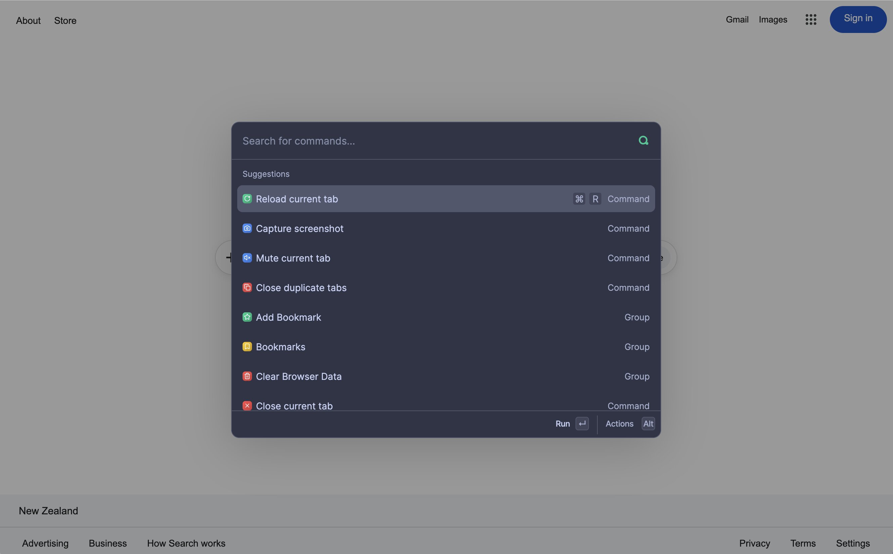
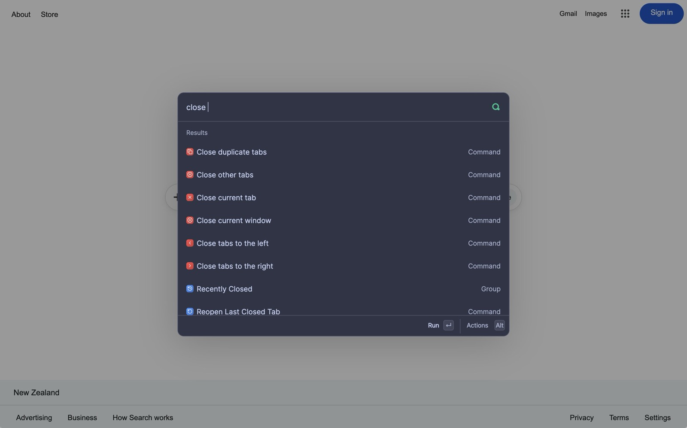
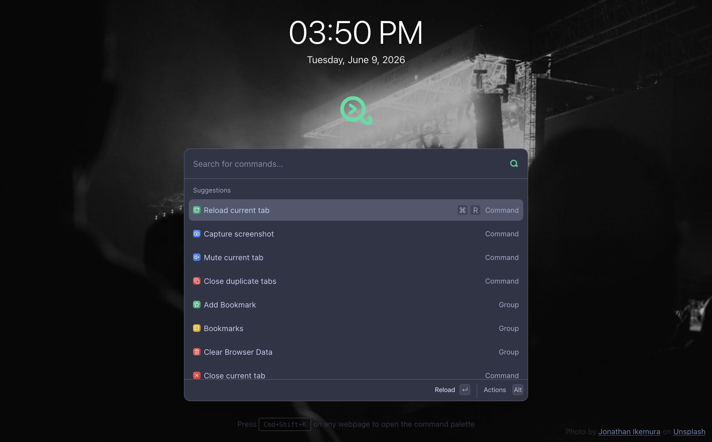
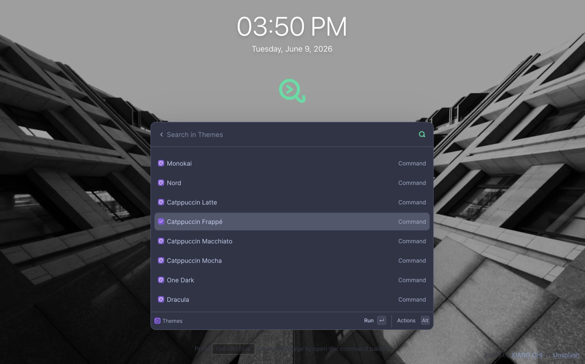
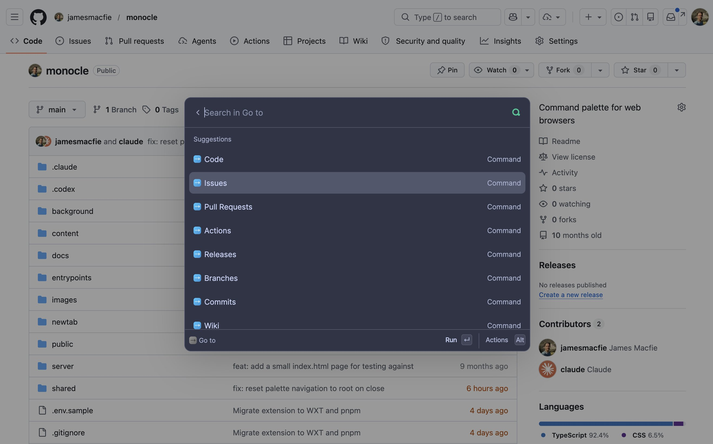

# Monocle

**A command palette for your browser.**

Think Spotlight. Or Raycast. But just for your browser.

Monocle puts a fast, keyboard-driven command palette on top of every page you
visit and on your new tab page. Open it with a shortcut, start typing, and run
browser actions, jump through history and bookmarks, switch themes, manage
Firefox containers, or trigger commands a website has added for itself. No mouse
required.

Works in **Chrome** and **Firefox** (both Manifest V3).



---

## Why Monocle

Most of what you do in a browser is buried in menus, right-click context menus,
or settings pages. Monocle surfaces all of it behind one shortcut. It is built
to be:

- **Fast** — search is instant and results are ranked by how you actually use them.
- **Keyboard-first** — navigate, execute, and run secondary actions without leaving the keys.
- **Contextual** — comes built in with common commands for set websites
- **Extensible by sites** — any web page can register its own session-only commands through the `window.Monocle` SDK.

---

## Features

### 🎯 Command palette

The heart of Monocle. Press **`Cmd+Shift+K`** (macOS) or **`Ctrl+Shift+K`**
(Windows/Linux) to open the palette over any page. Type to search across browser
actions, tabs, history, bookmarks, settings, and site commands. Hit `Enter` to
run a command, or `Cmd/Ctrl+Enter` for its alternate action (for example, "open
in a new tab"). Groups expand into nested pages, and forms let you pass input
inline.



### 🗂️ New tab page

Monocle can replace your new tab page with a calm, full-screen home: a large
clock, a daily background photo with photographer credit, and the command
palette front and center. The clock can be toggled on or off, and the whole
experience shares the same commands as the overlay.



### 🎨 Themes

Ten always-on color themes plus System / Light / Dark modes — Solarized,
Monokai, Nord, the Catppuccin family, One Dark, Dracula, and more. Open the
**Themes** command, browse them in a searchable list, and watch the palette
update live as you move through the options.



### 🕘 History

Search and jump through your browsing history, grouped by time period — Today,
Yesterday, Last Week, Last Month, and Older. Each entry shows its title, URL,
and visit time with a favicon. `Enter` opens it here; `Cmd/Ctrl+Enter` opens it
in a new tab. (Requires the `history` permission, granted on demand.)

### 🔖 Bookmarks

Browse your bookmarks by folder, search across them, and open any of them
without touching the bookmarks bar. Useful for keeping a clean, organized set of
saved pages within easy keyboard reach. (Requires the `bookmarks` permission,
granted on demand.)

### 🦊 Firefox containers

On Firefox, Monocle works with Multi-Account Containers. Open a fresh tab in any
container profile, or reopen the page you're on in a different container — all
from the palette. (Firefox only; requires the `contextualIdentities` and
`cookies` permissions.)
  

### 🌐 Webpage-specific commands

Monocle shows commands tailored to the site you're viewing. The built-in GitHub
integration, for example, adds repo, pull request, and issue navigation
("Conversation", "Commits", "Checks", "Files Changed", "Code") and a "Toggle
Star" action — and they only appear on `github.com`. Visibility is driven by
per-command URL rules, and you can manage your own allow/deny lists with the
**Manage Command Allow List** and **Manage Command Deny List** commands.



---

## Installation

Monocle is built with [WXT](https://wxt.dev/). To run it from source you'll need
**Node.js** and **pnpm 11** (this repo pins `pnpm@11.0.0` — `corepack enable`
will pick it up automatically).

```bash
git clone <repo-url>
cd monocle
pnpm install
```

### Run in development

Development mode rebuilds on save and launches a browser with the extension
loaded:

```bash
pnpm run dev          # default (Chrome)
pnpm run dev:chrome   # Chrome explicitly
pnpm run dev:firefox  # Firefox
```

### Build for production / load unpacked

```bash
pnpm run build           # Chrome (MV3) → .output/chrome-mv3/
pnpm run build:firefox   # Firefox (MV3) → .output/firefox-mv3/
pnpm run build:zip       # Packaged .zip in .output/
```

Then load the unpacked build:

- **Chrome** — go to `chrome://extensions`, enable **Developer mode**, click
  **Load unpacked**, and select `.output/chrome-mv3/`.
- **Firefox** — go to `about:debugging#/runtime/this-firefox`, click **Load
  Temporary Add-on…**, and select the `manifest.json` inside
  `.output/firefox-mv3/`.

Once loaded, press **`Cmd/Ctrl+Shift+K`** on any page to open the palette, or
open a new tab to see the Monocle home page.

---

## The `window.Monocle` SDK

Any website can add its own commands to the palette through a page-world SDK at
`window.Monocle`. This lets a site offer keyboard-driven actions — open its
search, jump to a section, run a saved query — directly inside Monocle, without
the site needing any special permissions.

Key properties of the SDK:

- **Session-only.** Commands live as long as the page does. They are not
  persisted and are scoped to the current tab, top-frame document, and origin.
- **Non-privileged.** Site commands run in the page. They cannot request
  extension permissions, call browser APIs through Monocle, or bind global
  keyboard shortcuts.
- **Validated at the boundary.** Every declaration is validated (strict schema,
  size limits, safe icons) before the extension ever sees it; the page owns the
  callback functions, the background owns command resolution and search.

### Quick start

```ts
const handle = window.Monocle.commands.register({
  namespace: "docs",
  name: "Docs",
  icon: { type: "lucide", name: "BookOpen" },
  commands: [
    {
      id: "open-search",
      type: "action",
      name: "Open Site Search",
      placement: "root",
      actionLabel: "Open",
      onExecute() {
        document.querySelector<HTMLInputElement>("[type='search']")?.focus()
      },
    },
  ],
})

// Replace the registered commands later…
handle.update([{ id: "help", type: "display", name: "Site help is unavailable" }])

// …or remove them entirely.
handle.dispose()
```

`register()` accepts a namespace, a display name/icon, and an array of commands.
It supports several command types — `action`, `submit` (forms), `group` (nested
pages), `search` (dynamic results), `input` (inline fields), and `display`
(static rows) — and commands can place themselves under the site's group or
directly at the palette root. Site commands respect the same URL rules,
favorites, and ranking as built-in commands.

See [`docs/site-sdk.md`](docs/site-sdk.md) for the full API reference, command
schema, callback event shapes, validation limits, and security model.

---

## Development

```bash
pnpm run tsc        # type-check
pnpm run fmt        # format (biome) — fmt:check to verify only
pnpm test           # run the Vitest suite
pnpm run build      # Chrome production build
```

The codebase is documented in depth under [`docs/`](docs/) — start with
[`docs/architecture.md`](docs/architecture.md) for runtime modes and data flow,
and [`CLAUDE.md`](CLAUDE.md) for the architecture map and working contract.

---

## License

Monocle is licensed under the
[PolyForm Noncommercial License 1.0.0](https://polyformproject.org/licenses/noncommercial/1.0.0/).
