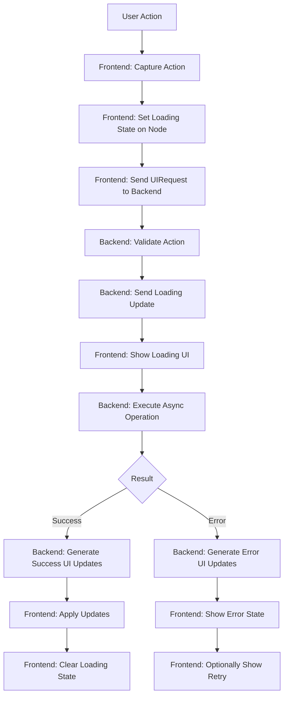

# Infinitely Nestable UI Architecture Proposal for Bifocal

## Executive Summary

This proposal outlines a new UI architecture for Bifocal that enables infinitely nestable UI components with dynamic actions, similar to Raycast's flexibility but with even more composability. The key innovation is moving from a command-centric model to a UI-centric model where the background script sends complete UI descriptions that the frontend simply renders.

## Core Concepts

### 1. UINode - The Fundamental Building Block

Every UI element is a `UINode` that can contain children and actions. This creates a tree structure that can be infinitely nested. Each node type has its own strongly-typed props.

```typescript
// Base node structure
interface UINode<T = any> {
  id: string;
  type: UINodeType;
  props?: T;  // Type-specific props
  children?: UINode[];
  actions?: UIAction[];
  state?: UINodeState;
}
```

### 2. UINodeType and Typed Props

```typescript
type UINodeType = 
  | "container"
  | "list"
  | "list-item"
  | "form"
  | "input"
  | "textarea"
  | "select"
  | "checkbox"
  | "radio"
  | "button"
  | "text"
  | "divider"
  | "grid"
  | "stack"
  | "image"
  | "icon"
  | "progress"
  | "skeleton"
  | "error"
  | "empty";

// Type-specific props for each node type
interface ListProps {
  searchable?: boolean;
  emptyMessage?: string;
}

interface ListItemProps {
  label: string;
  description?: string;
  icon?: Icon;
  color?: ColorName;
  badges?: Array<{
    text: string;
    color?: ColorName;
    variant?: "solid" | "outline" | "ghost";
  }>;
  accessory?: UINode; // Inline UI element
  keywords?: string[];
}

interface TextProps {
  content: string;  // Markdown supported
  truncate?: boolean;
  maxLines?: number;
}

interface InputProps {
  label?: string;
  placeholder?: string;
  type?: "text" | "password" | "email" | "number" | "url";
  required?: boolean;
  autoFocus?: boolean;
  defaultValue?: string;
}

interface ButtonProps {
  label: string;
  variant?: "primary" | "secondary" | "destructive" | "ghost";
  size?: "small" | "medium" | "large";
  icon?: Icon;
}

interface ContainerProps {
  title?: string;
  description?: string;
  padding?: boolean;
  scrollable?: boolean;
}

interface StackProps {
  direction?: "horizontal" | "vertical";
  spacing?: "none" | "small" | "medium" | "large";
  align?: "start" | "center" | "end" | "stretch";
}

interface GridProps {
  columns?: number;
  gap?: "small" | "medium" | "large";
}

interface SelectProps {
  label?: string;
  placeholder?: string;
  options: Array<{ value: string; label: string }>;
  defaultValue?: string;
  required?: boolean;
}

interface CheckboxProps {
  label: string;
  description?: string;
  defaultValue?: boolean;
}

// Properly typed UINode variants
type ContainerNode = UINode<ContainerProps>;
type ListNode = UINode<ListProps>;
type ListItemNode = UINode<ListItemProps>;
type TextNode = UINode<TextProps>;
type InputNode = UINode<InputProps>;
type SelectNode = UINode<SelectProps>;
type CheckboxNode = UINode<CheckboxProps>;
// ... etc
```

### 3. UINode Structure - Nodes vs Children

Clear separation between UI structure and selectable content:

```typescript
// Enhanced UINode with nodes for UI structure, children for selection content
interface UINode<T = any> {
  id: string;
  type: UINodeType;
  props?: T;
  nodes?: UINode[];  // Child nodes for UI structure (always rendered)
  actions?: UIAction[];
  state?: UINodeState;
  navigation?: NavigationConfig;
  search?: SearchConfig;
  navigatable?: boolean;  // Can this node be focused/selected?
  settings?: ComponentSettings;  // Component-specific settings configuration
}

// Type constraint for deep search nodes
type DeepSearchableNode<T = any> = UINode<T> & {
  search: SearchConfig & {
    deepSearch: true;
    deepSearchLabel: string;  // Required when deepSearch is true and has searchable descendants
  };
};

// Utility type to check if a node requires deepSearchLabel
type RequiresDeepSearchLabel<T extends UINode> = 
  T['search'] extends { deepSearch: true } 
    ? T['actions'] extends (infer A)[]
      ? A extends { children: UINode[] }
        ? HasSearchableDescendants<A['children'][number]> extends true
          ? T['search'] extends { deepSearchLabel: string }
            ? T
            : never  // Error: deepSearchLabel required
          : T
        : T
      : T
    : T;

type HasSearchableDescendants<T extends UINode> = 
  T['search'] extends { searchable: false }
    ? false
    : T['nodes'] extends UINode[]
      ? true
      : T['actions'] extends (infer A)[]
        ? A extends { children: UINode[] }
          ? true
          : false
        : false;
```

### 4. UIAction - Unified Action System

All interactions are actions - some just happen to render children and change navigation:

```typescript
interface UIAction {
  id: string;
  label: string;
  icon?: Icon;
  keybinding?: string;
  type: "primary" | "secondary" | "modifier";
  modifierKey?: ModifierKey;
  handler: ActionHandler;
  children?: UINode[] | string;  // Content to render when this action is selected
  submenu?: UIAction[]; // For nested action menus
}

// Actions fire backend operations, never direct requests
type ActionHandler = 
  | { type: "execute"; commandId: string; params?: Record<string, any> }
  | { type: "submit-form"; formId: string }
  | { type: "action"; actionId: string; params?: any } // Generic backend action
  | { type: "copy"; text: string }
  | { type: "open-url"; url: string }
  | { type: "noop" } // No backend action, just render children
```

### 5. NavigationConfig and SearchConfig

**Important:** `navigatable` is a top-level UINode property, not part of SearchConfig. It controls whether a node can be focused/selected, while SearchConfig controls search behavior.

Navigation and search behavior inferred from structure, minimal config needed:

```typescript
interface NavigationConfig {
  orientation?: "horizontal" | "vertical" | "grid";  // Primary navigation direction
  wrap?: boolean;  // Wrap around at edges
  tabOrder?: string[]; // For forms - explicit tab order by node IDs
}

interface SearchConfig {
  searchable?: boolean;  // Override auto-inferred searchability
  searchContext?: "always" | "never" | "auto";  // When to show search box
  searchTargets?: SearchTarget[];  // What to search on
  deepSearch?: boolean;  // Search through all nested action children
  deepSearchLabel?: string;  // Required label for breadcrumbs when deepSearch=true and has searchable children
}

interface SearchTarget {
  field: "label" | "description" | "content" | "keywords" | "alt";
  weight?: number;  // Search relevance weight (1-10)
}

// Component settings configuration
interface ComponentSettings {
  id: string;  // Settings namespace (e.g., "bookmarks", "calculator")
  version?: number;  // For settings migration
  schema?: SettingsSchema;  // Schema defining available settings
  defaults?: Record<string, any>;  // Default values for settings
}

interface SettingsSchema {
  properties: Record<string, SettingDefinition>;
  required?: string[];
}

interface SettingDefinition {
  type: "string" | "number" | "boolean" | "select";
  title: string;
  description?: string;
  default?: any;
  options?: Array<{ value: any; label: string }>;  // For select type
  min?: number;  // For number type
  max?: number;
}
```

### 6. Component Settings and Global State Management

The architecture supports both component-specific settings and global state management to enable rich customization and persistent preferences.

#### Component Settings

Each UI component can define its own settings with a schema that automatically generates the settings UI. Settings are defined at the UINode level and automatically create accessible settings actions.

```typescript
// Simple settings example
const calculatorUI: UINode = {
  id: "calculator",
  type: "container",
  props: { title: "Calculator" },
  settings: {
    id: "calculator",
    schema: {
      properties: {
        precision: {
          type: "number",
          title: "Decimal Precision",
          default: 2,
          min: 0,
          max: 10
        }
      }
    }
  },
  // Settings action is automatically added to actions array
  nodes: [/* calculator UI nodes */]
};
```

#### Complex Component Settings

For more complex components requiring multiple settings:

```typescript
// Example: Bookmarks component with settings
const bookmarksUI: UINode = {
  id: "bookmarks",
  type: "list",
  props: { searchable: true },
  settings: {
    id: "bookmarks",
    version: 1,
    schema: {
      properties: {
        defaultTabBehavior: {
          type: "select",
          title: "Default Tab Behavior",
          description: "How bookmarks open by default",
          default: "current",
          options: [
            { value: "current", label: "Current Tab" },
            { value: "new", label: "New Tab" }
          ]
        },
        showFavicons: {
          type: "boolean",
          title: "Show Favicons",
          description: "Display website icons",
          default: true
        }
      }
    },
    defaults: {
      defaultTabBehavior: "current",
      showFavicons: true
    }
  },
  actions: [
    {
      id: "bookmarks-settings",
      label: "Settings",
      type: "secondary",
      icon: { name: "Settings" },
      handler: { 
        type: "action", 
        actionId: "show-component-settings", 
        params: { componentId: "bookmarks" } 
      }
    }
  ]
};
```

#### Auto-Generated Settings UI

The backend automatically generates settings forms based on the schema. This leverages the existing UINode types (input, select, checkbox, etc.) to create consistent settings interfaces:

```typescript
// Generated settings form (created automatically from schema)
const bookmarkSettingsForm: UINode = {
  id: "bookmarks-settings-form",
  type: "form",
  search: { searchContext: "never" },
  nodes: [
    {
      id: "setting-defaultTabBehavior",
      type: "select",
      props: {
        label: "Default Tab Behavior",
        description: "How bookmarks open by default",
        options: [
          { value: "current", label: "Current Tab" },
          { value: "new", label: "New Tab" }
        ],
        defaultValue: "current"  // From current settings
      },
      navigatable: true
    },
    {
      id: "setting-showFavicons", 
      type: "checkbox",
      props: {
        label: "Show Favicons",
        description: "Display website icons",
        defaultValue: true
      },
      navigatable: true
    }
  ],
  actions: [
    {
      id: "save-settings",
      label: "Save Settings",
      type: "primary",
      handler: { 
        type: "action", 
        actionId: "save-component-settings", 
        params: { componentId: "bookmarks" } 
      }
    }
  ]
};
```

#### Global State Management

Global state includes system preferences, component settings, and user data. Unlike component settings which are specific to individual UI components, global settings affect the entire application:

```typescript
// Global settings example
const globalSettings = {
  theme: "dark",
  keyboardShortcuts: true,
  animationsEnabled: false,
  defaultLanguage: "en"
};

// Component settings are namespaced by component ID
const componentSettings = {
  "bookmarks": {
    defaultTabBehavior: "current",
    showFavicons: true
  },
  "calculator": {
    precision: 4,
    memoryEnabled: true
  }
};
```

The complete global state structure:

```typescript
// Global state structure (managed by background script)
interface GlobalState {
  // System preferences
  theme: "light" | "dark" | "auto";
  defaultBrowser: string;
  
  // Component settings by namespace
  componentSettings: Record<string, {
    values: Record<string, any>;
    lastModified: number;
    version: number;
  }>;
  
  // User data
  recentCommands: string[];
  favoriteCommands: string[];
  
  // Feature flags
  features: Record<string, boolean>;
}

// Settings are retrieved and applied during UI generation
export const bookmarksUIGenerator = async (): Promise<UINode> => {
  // Get component settings with defaults
  const settings = await getComponentSettings("bookmarks", {
    defaultTabBehavior: "current",
    showFavicons: true
  });
  
  // Use settings to customize UI generation
  const bookmarks = await getBookmarks();
  return {
    id: "bookmarks",
    type: "list",
    nodes: bookmarks.map(bookmark => createBookmarkItem(bookmark, settings)),
    settings: { /* schema definition */ }
  };
};

// Settings affect how individual UI nodes are rendered
function createBookmarkItem(bookmark: Bookmark, settings: BookmarkSettings): UINode {
  return {
    id: `bookmark-${bookmark.id}`,
    type: "list-item",
    props: {
      label: bookmark.title,
      icon: settings.showFavicons ? { url: bookmark.favicon } : undefined,
      description: bookmark.url
    },
    actions: [{
      id: "open",
      label: "Open",
      type: "primary",
      handler: { 
        type: "open-url", 
        url: bookmark.url,
        newTab: settings.defaultTabBehavior === "new"
      }
    }]
  };
}
```

#### Settings Message Types

```typescript
// Frontend requests settings
interface SettingsRequest {
  type: "get-settings" | "set-settings";
  componentId?: string;  // If undefined, returns global settings
  settings?: Record<string, any>;
}

// Backend responds with settings data
interface SettingsResponse {
  type: "settings-data";
  componentId?: string;
  settings: Record<string, any>;
  schema?: SettingsSchema;
}
```

### 7. UINodeState - Enhanced Interactive State

```typescript
interface UINodeState {
  // Selection and focus
  selected?: boolean;
  focused?: boolean;
  
  // Interaction states
  disabled?: boolean;
  hidden?: boolean;
  readonly?: boolean;
  
  // Data states
  value?: any;
  
  // Async states
  loading?: LoadingState;
  error?: ErrorState;
}

interface LoadingState {
  active: boolean;
  message?: string;
  progress?: number;  // 0-100 for progress bars
  showSkeleton?: boolean;  // Show skeleton vs spinner
  skeletonConfig?: {
    lines?: number;
    height?: string;
  };
}

interface ErrorState {
  message: string;
  details?: string;
  recoverable?: boolean;
  retryAction?: UIAction;
}
```

## Search and Filtering System

### Node Type Searchability Matrix

Different UI node types have different search behaviors:

```typescript
// Searchability by node type (auto-inferred)
const nodeSearchability = {
  // Always searchable - primary content
  "list-item": {
    searchable: true,
    searchTargets: ["label", "description", "keywords"],
    navigatable: true,
    deepSearch: false  // Can enable to search through action children
  },
  
  // Searchable on content
  "text": {
    searchable: true, 
    searchTargets: ["content"],
    navigatable: false  // Content-only, parent becomes selectable
  },
  
  // Settings form elements - contextually searchable
  "input": {
    searchable: "context",  // Only in settings forms, not active forms
    searchTargets: ["label", "placeholder"],
    navigatable: true
  },
  
  "select": {
    searchable: "context",  // Only in settings forms
    searchTargets: ["label"],
    navigatable: true
  },
  
  // Container types - searchable through children
  "container": {
    searchable: true,
    searchTargets: ["title", "description"],
    navigatable: false,  // Children become selectable
    searchContext: "auto",  // Show search if children are searchable
    deepSearch: false  // Can be enabled for deep nested search
  },
  
  "list": {
    searchable: true,
    navigatable: false,
    searchContext: "always",  // Always show search box
    deepSearch: true  // Lists can search deeply through nested content
  },
  
  // Never searchable
  "form": {
    searchable: false,
    navigatable: false,
    searchContext: "never"  // Never show search, only back button
  },
  
  "button": { searchable: false },  // Buttons not searchable but navigatable by default
  "divider": { searchable: false },  // Not searchable or navigatable
  "skeleton": { searchable: false },  // Not searchable or navigatable
  "progress": { searchable: false }   // Not searchable or navigatable
};
```

### Search Context Rules

When to show the search box:

```typescript
interface SearchContextResult {
  showSearch: boolean;
  showBackButton: boolean;
  placeholder?: string;
}

function determineSearchContext(node: UINode): SearchContextResult {
  // Explicit overrides
  if (node.search?.searchContext === "never") {
    return { showSearch: false, showBackButton: true };
  }
  if (node.search?.searchContext === "always") {
    return { showSearch: true, showBackButton: true, placeholder: "Search..." };
  }
  
  // Context-based inference
  switch (node.type) {
    case "form":
      // Forms never show search, only back button
      return { showSearch: false, showBackButton: true };
      
    case "list":
      // Lists always show search
      return { 
        showSearch: true, 
        showBackButton: true,
        placeholder: "Search items..." 
      };
      
    case "container":
      // Containers show search if they have searchable children
      const hasSearchableChildren = node.nodes?.some(child => 
        isNodeSearchable(child)
      );
      return {
        showSearch: hasSearchableChildren,
        showBackButton: true,
        placeholder: node.props?.title ? `Search ${node.props.title}...` : "Search..."
      };
      
    default:
      return { showSearch: false, showBackButton: true };
  }
}
```

### Deep Search Algorithm with Flattened Results

Search can crawl through action children and surface nested items directly:

```typescript
interface SearchResult {
  node: UINode;
  matchedFields: string[];
  score: number;
  navigateTo: string;  // ID of node to focus
  highlights: SearchHighlight[];
  breadcrumbs: BreadcrumbItem[];  // Path to nested item
  actionPath?: ActionPath[];  // Actions needed to reach this result
}

interface BreadcrumbItem {
  id: string;
  label: string;
  icon?: Icon;
}

interface ActionPath {
  nodeId: string;
  actionId: string;
  actionLabel: string;
}

function searchNodes(nodes: UINode[], query: string, rootContext?: BreadcrumbItem[]): SearchResult[] {
  const results: SearchResult[] = [];
  
  for (const node of nodes) {
    const nodeResults = searchNode(node, query, rootContext || []);
    results.push(...nodeResults);
  }
  
  return results.sort((a, b) => b.score - a.score);
}

function searchNode(
  node: UINode, 
  query: string, 
  breadcrumbs: BreadcrumbItem[] = []
): SearchResult[] {
  const results: SearchResult[] = [];
  const currentBreadcrumbs = [...breadcrumbs];
  
  // Add current node to breadcrumbs using deepSearchLabel (required when deepSearch is true)
  if (node.search?.deepSearchLabel) {
    currentBreadcrumbs.push({
      id: node.id,
      label: node.search.deepSearchLabel,
      icon: node.props?.icon
    });
  }
  
  // Direct match on this node
  const directMatch = matchNodeContent(node, query);
  if (directMatch && node.search?.searchable !== false) {
    results.push({
      node,
      matchedFields: directMatch.fields,
      score: directMatch.score,
      navigateTo: node.navigatable !== false ? node.id : node.id,
      highlights: directMatch.highlights,
      breadcrumbs: currentBreadcrumbs.slice(0, -1), // Don't include self in breadcrumbs
      actionPath: []
    });
  }
  
  // Search immediate children
  if (node.nodes) {
    for (const child of node.nodes) {
      const childResults = searchNode(child, query, currentBreadcrumbs);
      results.push(...childResults);
    }
  }
  
  // Deep search through action children (if enabled)
  if (node.search?.deepSearch && node.actions) {
    for (const action of node.actions) {
      if (action.children && Array.isArray(action.children)) {
        const actionResults = searchActionChildren(
          action.children, 
          query, 
          currentBreadcrumbs,
          [{
            nodeId: node.id,
            actionId: action.id,
            actionLabel: action.label
          }]
        );
        results.push(...actionResults);
      }
    }
  }
  
  return results;
}

function searchActionChildren(
  children: UINode[],
  query: string,
  breadcrumbs: BreadcrumbItem[],
  actionPath: ActionPath[]
): SearchResult[] {
  const results: SearchResult[] = [];
  
  for (const child of children) {
    const childResults = searchNode(child, query, breadcrumbs);
    
    // Add action path to all results from action children
    for (const result of childResults) {
      result.actionPath = [...actionPath, ...(result.actionPath || [])];
      // Boost score slightly for nested results to show user can find deep content
      result.score *= 1.1;
    }
    
    results.push(...childResults);
  }
  
  return results;
}
```

### Search Configuration Examples

```typescript
// Settings panel - searchable with context
const settingsPanel: UINode = {
  id: "settings",
  type: "list",
  search: {
    searchContext: "always",
    searchTargets: [
      { field: "label", weight: 10 },
      { field: "description", weight: 5 },
      { field: "keywords", weight: 3 }
    ]
  },
  nodes: [
    {
      id: "appearance",
      type: "list-item", 
      props: {
        label: "Appearance",
        description: "Themes, colors, and layout",
        keywords: ["theme", "dark", "light", "color", "ui"]
      },
      // This item is searchable and navigatable
      navigatable: true
    }
  ]
};

// Form - no search, only back button
const loginForm: UINode = {
  id: "login-form",
  type: "form",
  search: {
    searchContext: "never"  // Never show search box
  },
  nodes: [
    {
      id: "username-input",
      type: "input",
      props: { label: "Username" },
      search: { 
        searchable: false,  // Don't search form inputs
        navigatable: true 
      }
    },
    {
      id: "submit-btn",
      type: "button",
      props: { label: "Login" },
      search: { 
        searchable: false,  // Don't search submit buttons
        navigatable: true 
      }
    }
  ]
};

// Complex widget - searchable through nested content
const githubWidget: UINode = {
  id: "github-widget",
  type: "container",
  props: { title: "GitHub Repositories" },
  search: {
    searchContext: "auto",  // Show search if children are searchable
    searchTargets: [{ field: "title", weight: 5 }]
  },
  nodes: [
    {
      id: "repo-list",
      type: "list",
      search: { searchContext: "always" },
      nodes: [
        {
          id: "repo-1",
          type: "list-item",
          props: {
            label: "awesome-project",
            description: "A TypeScript library for...",
            keywords: ["typescript", "library", "awesome"]
          },
          navigatable: true,
          nodes: [
            // Non-navigatable content that can be searched
            {
              id: "repo-stats",
              type: "text",
              props: { content: "⭐ 1.2k stars, 45 forks" },
              search: { 
                navigatable: false,  // This text isn't selectable
                searchTargets: [{ field: "content", weight: 1 }]
              }
            }
          ]
        }
      ]
    }
  ]
};
```

### Flattened Search Results UI

When deep search is enabled, results can come from any nesting level and be displayed directly:

```typescript
// Bookmarks example with deep search enabled
const bookmarks: DeepSearchableNode = {
  id: "bookmarks",
  type: "list",
  search: {
    searchContext: "always",
    deepSearch: true,  // Enable deep searching through action children
    deepSearchLabel: "Bookmarks"  // Required for breadcrumbs when deepSearch is true
  },
  nodes: [
    {
      id: "work-folder",
      type: "list-item",
      props: {
        label: "Work",
        icon: { name: "Folder" },
        keywords: ["work", "office", "business"]
      },
      search: { 
        navigatable: true, 
        deepSearch: true,
        deepSearchLabel: "Work Bookmarks"  // Required for nested breadcrumbs
      },
      actions: [
        {
          id: "browse-work",
          label: "Browse",
          handler: { type: "noop" },
          children: [
            {
              id: "work-bookmarks",
              type: "list",
              nodes: [
                {
                  id: "github-work",
                  type: "list-item",
                  props: {
                    label: "GitHub",
                    description: "github.com/company",
                    keywords: ["git", "code", "repository"]
                  }
                },
                {
                  id: "slack-work",
                  type: "list-item", 
                  props: {
                    label: "Team Slack",
                    description: "company.slack.com",
                    keywords: ["chat", "communication", "team"]
                  }
                }
              ]
            }
          ]
        }
      ]
    },
    {
      id: "personal-folder",
      type: "list-item",
      props: {
        label: "Personal", 
        icon: { name: "User" }
      },
      search: { 
        navigatable: true, 
        deepSearch: true,
        deepSearchLabel: "Personal Bookmarks"  // Required for nested breadcrumbs
      },
      actions: [
        {
          id: "browse-personal",
          label: "Browse",
          handler: { type: "noop" },
          children: [
            {
              id: "personal-bookmarks",
              type: "list",
              nodes: [
                {
                  id: "github-personal",
                  type: "list-item",
                  props: {
                    label: "Personal GitHub",
                    description: "github.com/username",
                    keywords: ["git", "personal", "projects"]
                  }
                }
              ]
            }
          ]
        }
      ]
    }
  ]
};

// Search results for query "github":
const searchResults: SearchResult[] = [
  {
    node: /* github-work node */,
    matchedFields: ["label"],
    score: 10,
    navigateTo: "github-work",
    highlights: [{ field: "label", start: 0, end: 6 }],
    breadcrumbs: [
      { id: "bookmarks", label: "Bookmarks" },
      { id: "work-folder", label: "Work Bookmarks", icon: { name: "Folder" } }
    ],
    actionPath: [
      { nodeId: "work-folder", actionId: "browse-work", actionLabel: "Browse" }
    ]
  },
  {
    node: /* github-personal node */,
    matchedFields: ["label", "description"],
    score: 9,
    navigateTo: "github-personal", 
    highlights: [{ field: "label", start: 9, end: 15 }],
    breadcrumbs: [
      { id: "bookmarks", label: "Bookmarks" },
      { id: "personal-folder", label: "Personal Bookmarks", icon: { name: "User" } }
    ],
    actionPath: [
      { nodeId: "personal-folder", actionId: "browse-personal", actionLabel: "Browse" }
    ]
  }
];

// UI renders flattened results with proper breadcrumbs:
// Bookmarks > Work Bookmarks > GitHub (github.com/company) 
// Bookmarks > Personal Bookmarks > Personal GitHub (github.com/username)
```

### Context Menu Behavior for Deep Search Results

When user navigates to a deep search result, the context menu shows actions from the actual nested node:

```typescript
interface SearchResultState {
  currentSearchResults: SearchResult[];
  focusedResultIndex: number;
}

function getContextMenuActions(state: UIState): UIAction[] {
  // If we're viewing search results and have a focused item
  if (state.searchResults && state.searchResults.length > 0) {
    const focusedResult = state.searchResults[state.focusedResultIndex];
    
    // Return actions from the actual nested node, not the breadcrumb parent
    return focusedResult.node.actions || [];
  }
  
  // Normal navigation - return actions from currently focused node
  const focusedNode = getCurrentlyFocusedNode(state);
  return focusedNode?.actions || [];
}
```

### Search Result Navigation Flow

When user selects a deep search result:

1. **Auto-navigation**: System automatically executes action path to reach the result
2. **Breadcrumb context**: Shows user where they are using deepSearchLabel hierarchy  
3. **Focus management**: Target item gets focus once navigation completes
4. **Context menu**: Shows actions from the actual nested node

```typescript
// User selects "github-work" from search results
async function navigateToSearchResult(result: SearchResult) {
  // 1. Execute action path to reach the result
  for (const step of result.actionPath) {
    await executeAction(step.nodeId, step.actionId);
    // This updates the UI to show the action's children
  }
  
  // 2. Focus the target node
  focusNode(result.navigateTo);
  
  // 3. Update navigation stack with breadcrumb context
  navigationStack.push({
    actionId: result.actionPath[result.actionPath.length - 1]?.actionId,
    parentNodeId: result.breadcrumbs[result.breadcrumbs.length - 1]?.id,
    focusedChildId: result.navigateTo
  });
  
  // 4. Context menu will now show actions from result.node, not parent
  updateContextMenuActions(result.node.actions);
}
```

## Data Model Examples

### Example 1: Calculator Container

```typescript
const calculatorUI: ContainerNode = {
  id: "calculator",
  type: "container",
  props: {
    title: "Calculator",
    description: "Simple expression calculator",
    padding: true
  },
  children: [
    {
      id: "calc-display",
      type: "text",
      props: { 
        content: "**Result:** 0"  // Using markdown for bold
      },
      state: { value: "0" }
    },
    {
      id: "calc-input",
      type: "input",
      props: {
        placeholder: "Enter expression (e.g., 2+2)",
        autoFocus: true,
        type: "text"
      },
      actions: [
        {
          id: "calculate",
          label: "Calculate",
          type: "primary",
          keybinding: "↵",
          handler: {
            type: "request",
            endpoint: "calculate",
            method: "POST"
          }
        },
        {
          id: "clear",
          label: "Clear",
          type: "secondary",
          keybinding: "⌘⌫",
          handler: {
            type: "update",
            updates: [
              { nodeId: "calc-display", state: { value: "0" } },
              { nodeId: "calc-input", state: { value: "" } }
            ]
          }
        }
      ]
    },
    {
      id: "calc-history",
      type: "list",
      props: { 
        searchable: false,
        emptyMessage: "No calculations yet"
      },
      children: [] // Populated dynamically
    }
  ]
};
```

### Example 2: Nested Bookmarks

```typescript
const bookmarksUI: ListNode = {
  id: "bookmarks",
  type: "list",
  props: {
    searchable: true
  },
  children: [
    {
      id: "work-folder",
      type: "list-item",
      props: {
        label: "Work",
        icon: { name: "Folder" },
        badges: [{ text: "12", color: "blue" }],
        description: "Work related bookmarks",
        keywords: ["work", "office", "projects"]
      },
      actions: [
        {
          id: "expand",
          label: "Expand",
          type: "primary",
          handler: { type: "navigate", nodeId: "work-folder-contents" }
        },
        {
          id: "open-all",
          label: "Open All",
          type: "secondary",
          handler: { type: "execute", commandId: "open-all-bookmarks" }
        }
      ],
      children: [
        {
          id: "work-folder-contents",
          type: "list",
          props: {},
          children: [
            {
              id: "github",
              type: "list-item",
              props: {
                label: "GitHub",
                icon: { url: "https://github.com/favicon.ico" },
                description: "github.com",
                accessory: {
                  id: "github-stars",
                  type: "text",
                  props: { content: "⭐ 42" }
                }
              },
              actions: [
                {
                  id: "open",
                  label: "Open",
                  type: "primary",
                  handler: { type: "open-url", url: "https://github.com" }
                },
                {
                  id: "open-new-tab",
                  label: "Open in New Tab",
                  type: "modifier",
                  modifierKey: "cmd",
                  handler: { 
                    type: "execute", 
                    commandId: "open-in-new-tab",
                    params: { url: "https://github.com" }
                  }
                }
              ]
            }
          ]
        }
      ]
    }
  ]
};
```

### Example 3: Dynamic Form with Validation

```typescript
const searchFormUI: UINode<{}> = {
  id: "search-form",
  type: "form",
  children: [
    {
      id: "search-engine",
      type: "select",
      props: {
        label: "Search Engine",
        options: [
          { value: "google", label: "Google" },
          { value: "bing", label: "Bing" },
          { value: "duckduckgo", label: "DuckDuckGo" }
        ],
        defaultValue: "google"
      },
      state: { value: "google" }
    },
    {
      id: "search-query",
      type: "input",
      props: {
        label: "Query",
        placeholder: "What are you looking for?",
        required: true,
        type: "text"
      },
      state: { 
        value: "",
        error: null
      }
    },
    {
      id: "search-filters",
      type: "stack",
      props: { 
        direction: "horizontal",
        spacing: "medium"
      },
      children: [
        {
          id: "safe-search",
          type: "checkbox",
          props: { 
            label: "Safe Search",
            defaultValue: true
          }
        },
        {
          id: "new-tab",
          type: "checkbox", 
          props: { 
            label: "Open in New Tab",
            defaultValue: false
          }
        }
      ]
    },
    {
      id: "submit",
      type: "button",
      props: { 
        label: "Search",
        variant: "primary",
        icon: { name: "Search" }
      },
      actions: [
        {
          id: "submit-search",
          label: "Search",
          type: "primary",
          handler: { type: "submit-form", formId: "search-form" }
        }
      ]
    }
  ]
};
```

## Message Passing Architecture

### Frontend → Backend Messages

```typescript
interface UIRequest {
  type: "ui-action";
  action: ActionHandler;
  context: UIContext;
  nodeStates?: Record<string, UINodeState>; // Current state of relevant nodes
}

interface UIContext {
  currentNodeId: string;
  navigationPath: string[];  // Full path of navigated nodes
  focusedNodeId: string;
  formValues?: Record<string, any>;
  modifierKeys?: ModifierKey[];
  searchQuery?: string;
  viewport?: {  // For virtualization
    visibleNodeIds: string[];
    scrollPosition: number;
  };
}
```

### Backend → Frontend Messages

```typescript
interface UIResponse {
  type: "ui-update" | "ui-error" | "ui-navigate";
  requestId?: string;  // To match async responses
  updates?: UIUpdate[];
  error?: UIError;
  navigation?: NavigationInstruction;
}

interface UIUpdate {
  type: "replace" | "append" | "prepend" | "remove" | "patch" | "state";
  nodeId: string;
  node?: UINode; // For replace/append/prepend
  patches?: Partial<UINode>; // For patch
  state?: Partial<UINodeState>; // For state updates only
}

interface UIError {
  nodeId: string;
  error: ErrorState;
  fallbackUI?: UINode;  // Optional replacement UI for error state
}

interface NavigationInstruction {
  targetNodeId: string;
  action: "push" | "replace" | "pop";
  focusChildId?: string;
}
```

## State Management

### Frontend State Layer

```typescript
interface UIState {
  // The UI tree from backend
  root: UINode;
  
  // Navigation state - tracks selected actions that render children
  navigation: {
    stack: NavigationFrame[];  // Navigation stack for back/forward
    currentFrameIndex: number;
    focusedNodeId: string;
  };
  
  // Currently rendered action children (overlays on top of base UI)
  activeChildren: Map<string, UINode[]>;  // actionId -> rendered children
  
  // Form state
  forms: Map<string, FormState>;
  
  // Async operations
  requests: Map<string, AsyncRequest>;
  
  // Node-specific loading states
  nodeLoadingStates: Map<string, LoadingState>;
  
  // Error states
  errors: Map<string, ErrorState>;
}

interface NavigationFrame {
  actionId: string;  // Which action was selected to get here
  parentNodeId: string;  // Node that had the action
  focusedChildId?: string;  // Which child was focused in this frame
  scrollPosition?: number;
  timestamp: number;
}

interface FormState {
  values: Record<string, any>;
  errors: Record<string, string>;
  touched: Set<string>;
  submitting: boolean;
  lastSubmitTime?: number;
}

interface AsyncRequest {
  id: string;
  actionHandler: ActionHandler;
  startedAt: number;
  status: "pending" | "success" | "error";
  error?: ErrorState;
  retryCount: number;
  nodeId: string;  // Node that initiated the request
}
```

### State Update Flow for Async Operations



### Simplified Keyboard Navigation

Navigation behavior is inferred from structure and minimal config:

```typescript
class KeyboardNavigator {
  computeNavigation(
    currentNode: UINode, 
    direction: "up" | "down" | "left" | "right"
  ): NavigationResult {
    
    const config = currentNode.navigation;
    const orientation = config?.orientation || this.inferOrientation(currentNode);
    
    switch (orientation) {
      case "horizontal":
        if (direction === "left" || direction === "right") {
          return this.navigateSiblings(currentNode, direction);
        }
        break;
        
      case "vertical":
        if (direction === "up" || direction === "down") {
          return this.navigateSiblings(currentNode, direction);
        }
        break;
        
      case "grid":
        return this.navigateGrid(currentNode, direction);
    }
    
    // Cross-axis navigation or action triggers
    if (direction === "right" && this.hasSelectableActions(currentNode)) {
      return { type: "trigger-primary-action", nodeId: currentNode.id };
    }
    
    if (direction === "left") {
      return { type: "navigate-back" };
    }
    
    return { type: "no-op" };
  }
  
  private inferOrientation(node: UINode): "horizontal" | "vertical" | "grid" {
    // Infer from node type and structure
    if (node.type === "stack" && node.props?.direction === "horizontal") {
      return "horizontal";
    }
    if (node.type === "grid") {
      return "grid";
    }
    return "vertical"; // Default for lists, forms, etc.
  }
  
  private hasSelectableActions(node: UINode): boolean {
    return node.actions && node.actions.length > 0;
  }
}

interface NavigationResult {
  type: "focus-node" | "trigger-primary-action" | "navigate-back" | "no-op";
  nodeId?: string;
}
```

## Implementation Changes

### 1. New Types File Structure

```typescript
// types/ui.ts - Core UI types
export interface UINode { ... }
export interface UIAction { ... }
// No UIMetadata - props are type-specific

// types/messages.ts - Message types
export interface UIMessage { ... }
export interface UIResponse { ... }

// types/state.ts - State management types
export interface UIState { ... }
export interface FormState { ... }
```

### 2. Background Script Changes

```typescript
// background/ui/generator.ts
export class UIGenerator {
  async generateUI(request: UIRequest): Promise<UINode> {
    // Generate UI based on request type
  }
  
  async handleAction(action: UIAction, context: UIContext): Promise<UIResponse> {
    // Process action and return UI updates
  }
}

// background/ui/builders.ts
export const builders = {
  list: (items: any[]): ListNode => { ... },
  form: (fields: FormField[]): UINode => { ... },
  container: (config: ContainerConfig): ContainerNode => { ... }
};
```

### 3. Frontend Component Changes

```typescript
// shared/components/UIRenderer.tsx
export const UIRenderer: React.FC<{ node: UINode }> = ({ node }) => {
  const Component = componentMap[node.type];
  return <Component {...node} />;
};

// shared/hooks/useUIState.tsx
export const useUIState = () => {
  const [state, dispatch] = useReducer(uiReducer, initialState);
  // Handle actions, updates, navigation
  return { state, dispatch, actions };
};
```

## Migration Strategy

### Phase 1: Add UI Types Alongside Existing
- Keep current Command types
- Add new UINode types
- Create adapters to convert Commands → UINodes

### Phase 2: Implement UIRenderer
- Build new UIRenderer component
- Support rendering both Commands and UINodes
- Test with simple UI structures

### Phase 3: Convert Commands to UI Generators
- Migrate commands one by one
- Start with simple list commands
- Move to complex forms and widgets

### Phase 4: Remove Legacy Code
- Remove old Command types
- Clean up adapters
- Full UI-centric architecture

## Benefits

1. **Infinite Nesting**: Any UINode can contain any other UINode
2. **Dynamic Updates**: Backend can push UI changes without full re-renders
3. **Rich Interactions**: Multiple action types with contextual menus
4. **Better State Management**: Clear separation of UI structure and interaction state
5. **Extensibility**: Easy to add new UI types and actions
6. **Consistency**: Single source of truth for UI structure in backend

## Examples of Complex Nested UIs

### Example: GitHub Repository Browser

```typescript
const githubBrowser: ContainerNode = {
  id: "github",
  type: "container",
  props: {
    title: "GitHub Browser",
    scrollable: true
  },
  children: [
    {
      id: "repo-search",
      type: "input",
      props: { 
        placeholder: "Search repositories...",
        type: "text",
        autoFocus: true
      },
      actions: [{
        id: "search",
        label: "Search",
        type: "primary",
        handler: { type: "action", actionId: "search-repos" }
      }]
    },
    {
      id: "results",
      type: "list",
      props: {
        searchable: false
      },
      children: [
        {
          id: "repo-1",
          type: "list-item",
          props: {
            label: "awesome-project",
            description: "An awesome TypeScript project",
            icon: { name: "GitBranch" },
            badges: [
              { text: "TypeScript", color: "blue" },
              { text: "100 ⭐", color: "yellow" }
            ],
            accessory: {
              id: "last-commit",
              type: "text",
              props: { content: "_2 hours ago_" }  // Markdown for italics
            }
          },
          // Deferred children - only shown when navigated into
          deferredChildren: [
            {
              id: "repo-1-details",
              type: "container",
              props: {
                padding: true
              },
              children: [
                {
                  id: "readme",
                  type: "text",
                  props: { 
                    content: "## README\n\nLoading..."  // Markdown content
                  },
                  state: { 
                    loading: {
                      active: true,
                      showSkeleton: true,
                      skeletonConfig: { lines: 5 }
                    }
                  }
                },
                {
                  id: "actions",
                  type: "stack",
                  children: [
                    { 
                      id: "clone",
                      type: "button",
                      props: { label: "Clone" }
                    },
                    {
                      id: "open-pr",
                      type: "button", 
                      props: { label: "Open PR" }
                    }
                  ]
                }
              ]
            }
          ]
        }
      ]
    }
  ]
};
```

### Example: Async Weather Widget

```typescript
// Initial UI sent from backend
const weatherWidget: ContainerNode = {
  id: "weather",
  type: "container",
  props: {
    title: "Weather",
    description: "Get current weather and forecast"
  },
  children: [
    {
      id: "location-input",
      type: "input",
      props: { 
        placeholder: "Enter city...",
        type: "text"
      }
    },
    {
      id: "weather-display",
      type: "skeleton", // Loading state
      props: {}
    }
  ]
};

// After async request completes, backend sends update:
const weatherUpdate: UIResponse = {
  type: "ui-update",
  updates: [{
    type: "replace",
    nodeId: "weather-display",
    node: {
      id: "weather-display",
      type: "grid",
      props: {
        columns: 2,
        gap: "medium"
      },
      children: [
        {
          id: "current",
          type: "stack",
          props: {
            direction: "vertical",
            align: "center"
          },
          children: [
            { 
              type: "icon", 
              props: { name: "Sun" } 
            },
            { 
              type: "text", 
              props: { content: "# 72°F" }  // Markdown heading
            },
            { 
              type: "text", 
              props: { content: "**Sunny**" }  // Markdown bold
            }
          ]
        },
        {
          id: "forecast",
          type: "list",
          children: [
            // 5-day forecast items...
          ]
        }
      ]
    }
  }]
};
```

## Advanced Examples

### Example: Form with Async Submission and Error Handling

```typescript
// Initial form state
const loginForm: UINode = {
  id: "login-form",
  type: "form",
  children: [
    {
      id: "username",
      type: "input",
      props: {
        label: "Username",
        type: "text",
        required: true
      }
    },
    {
      id: "password",
      type: "input",
      props: {
        label: "Password",
        type: "password",
        required: true
      }
    },
    {
      id: "submit-btn",
      type: "button",
      props: {
        label: "Login",
        variant: "primary"
      },
      actions: [{
        id: "login",
        label: "Login",
        type: "primary",
        handler: { type: "submit-form", formId: "login-form" }
      }]
    }
  ]
};

// Backend receives form submission, sends loading state
const loadingUpdate: UIResponse = {
  type: "ui-update",
  updates: [
    {
      type: "state",
      nodeId: "submit-btn",
      state: { 
        loading: { 
          active: true, 
          message: "Authenticating..." 
        },
        disabled: true
      }
    }
  ]
};

// If authentication fails, backend sends error update
const errorUpdate: UIResponse = {
  type: "ui-error",
  error: {
    nodeId: "login-form",
    error: {
      message: "Invalid credentials",
      details: "Username or password is incorrect",
      recoverable: true,
      retryAction: {
        id: "retry-login",
        label: "Try Again",
        type: "primary",
        handler: { type: "submit-form", formId: "login-form" }
      }
    },
    fallbackUI: {
      id: "login-error",
      type: "container",
      children: [
        {
          id: "error-message",
          type: "text",
          props: {
            content: "⚠️ **Login Failed**\n\nInvalid username or password. Please try again."
          }
        },
        // Original form fields preserved...
      ]
    }
  }
};
```

### Example: File Browser with Search and Multiple Actions

```typescript
const fileExplorer: DeepSearchableNode = {
  id: "file-explorer",
  type: "list",
  props: { searchable: true },
  navigation: { orientation: "vertical" },
  search: {
    searchContext: "always",  // Always show search box
    deepSearch: true,  // Search through action children
    deepSearchLabel: "Files",  // Required for breadcrumbs
    searchTargets: [
      { field: "label", weight: 10 },
      { field: "description", weight: 5 },
      { field: "keywords", weight: 3 }
    ]
  },
  
  // UI structure - always rendered
  nodes: [
    {
      id: "documents-folder",
      type: "list-item",
      props: {
        label: "Documents",
        icon: { name: "Folder" },
        description: "12 files",
        badges: [{ text: "Shared", color: "blue" }],
        keywords: ["folder", "files", "shared", "work"]
      },
      search: { 
        navigatable: true,
        deepSearchLabel: "Documents Folder"  // Clearer breadcrumb for complex widget-like folder
      },
      actions: [
        {
          id: "browse-folder",
          label: "Browse",
          type: "primary",
          handler: { type: "noop" },  // No backend action needed
          // Children rendered when this action is selected
          children: [
            {
              id: "folder-contents",
              type: "list",
              props: { searchable: true },
              nodes: [
                {
                  id: "file-1",
                  type: "list-item",
                  props: { 
                    label: "report.pdf", 
                    icon: { name: "FileText" },
                    description: "Quarterly business report",
                    keywords: ["pdf", "report", "business", "quarterly"]
                  },
                  navigatable: true
                },
                {
                  id: "file-2", 
                  type: "list-item",
                  props: { 
                    label: "budget.xlsx", 
                    icon: { name: "Sheet" },
                    description: "2024 financial projections",
                    keywords: ["excel", "budget", "finance", "2024"]
                  },
                  navigatable: true
                }
              ]
            }
          ]
        },
        {
          id: "folder-info",
          label: "Get Info",
          type: "secondary",
          handler: { type: "action", actionId: "get-folder-info" },
          // Different children for info view
          children: [
            {
              id: "info-panel",
              type: "container",
              props: { padding: true },
              nodes: [
                {
                  id: "info-title",
                  type: "text",
                  props: { content: "# Folder Information" }
                },
                {
                  id: "info-details",
                  type: "stack",
                  props: { direction: "vertical", spacing: "small" },
                  nodes: [
                    { 
                      type: "text", 
                      props: { content: "**Size:** 2.4 MB" } 
                    },
                    { 
                      type: "text", 
                      props: { content: "**Modified:** Yesterday" } 
                    },
                    { 
                      type: "text", 
                      props: { content: "**Permissions:** Read/Write" } 
                    }
                  ]
                }
              ]
            }
          ]
        }
      ]
    },
    {
      id: "photo.jpg",
      type: "list-item",
      props: {
        label: "vacation.jpg",
        icon: { name: "Image" },
        description: "2.1 MB",
        keywords: ["photo", "vacation", "beach", "sunset"]
      },
      navigatable: true,
      // Nested searchable content
      nodes: [
        {
          id: "photo-metadata",
          type: "text",
          props: { content: "Taken at **Sunset Beach** on July 15, 2024. Camera: Canon EOS R5" },
          search: { 
            navigatable: false,  // This text content isn't selectable
            searchTargets: [{ field: "content", weight: 2 }]
          }
        }
      ],
      actions: [
        {
          id: "view-image",
          label: "View", 
          type: "primary",
          handler: { type: "noop" },
          children: [
            {
              id: "image-viewer",
              type: "container",
              nodes: [
                {
                  id: "image-display",
                  type: "image",
                  props: { src: "/path/to/vacation.jpg", alt: "Vacation photo" }
                }
              ]
            }
          ]
        },
        {
          id: "edit-image",
          label: "Edit",
          type: "secondary", 
          handler: { type: "action", actionId: "open-image-editor" },
          children: [
            {
              id: "edit-tools",
              type: "stack",
              props: { direction: "horizontal" },
              nodes: [
                { 
                  type: "button", 
                  props: { label: "Crop", icon: { name: "Crop" } } 
                },
                { 
                  type: "button", 
                  props: { label: "Rotate", icon: { name: "RotateCw" } } 
                },
                { 
                  type: "button", 
                  props: { label: "Filter", icon: { name: "Palette" } } 
                }
              ]
            }
          ]
        }
      ]
    }
  ]
};

// Deep search behavior examples:
// 1. Searching "Documents" → matches documents-folder directly (normal result)
// 2. Searching "report" → matches file-1 inside browse action's children  
//    → Shows flattened result: "Files > Documents Folder > report.pdf"
//    → Selecting auto-navigates: documents-folder → Browse action → focuses file-1
//    → Context menu shows actions from the report.pdf node (Open, Share, etc.)
// 3. Searching "Canon EOS" → matches photo-metadata text content
//    → Shows: "Files > vacation.jpg > metadata text" (parent becomes navigatable)
// 4. deepSearchLabel provides clear breadcrumbs even for complex nested UI
// 5. Context menu always shows actions from the actual focused nested node
```

### Example: Settings Panel with Nested Configuration

```typescript
const settingsPanel: UINode = {
  id: "settings",
  type: "list",
  props: { searchable: false },
  navigation: { orientation: "vertical" },
  search: {
    searchContext: "always",
    searchTargets: [
      { field: "label", weight: 10 },
      { field: "description", weight: 7 },
      { field: "keywords", weight: 5 }
    ]
  },
  
  nodes: [
    {
      id: "appearance-setting",
      type: "list-item",
      props: {
        label: "Appearance",
        icon: { name: "Palette" },
        description: "Themes, colors, and layout",
        keywords: ["theme", "dark", "light", "ui", "design", "color"]
      },
      navigatable: true,
      actions: [
        {
          id: "configure-appearance",
          label: "Configure",
          type: "primary",
          handler: { type: "noop" },
          children: [
            {
              id: "appearance-options",
              type: "container", 
              nodes: [
                {
                  id: "theme-selector",
                  type: "select",
                  props: {
                    label: "Theme",
                    options: [
                      { value: "light", label: "Light" },
                      { value: "dark", label: "Dark" },
                      { value: "auto", label: "Auto" }
                    ],
                    defaultValue: "auto"
                  },
                  search: {
                    searchable: true,  // Settings form elements are searchable
                    navigatable: true,
                    searchTargets: [{ field: "label", weight: 8 }]
                  }
                },
                {
                  id: "color-scheme",
                  type: "select",
                  props: {
                    label: "Accent Color", 
                    options: [
                      { value: "blue", label: "Blue" },
                      { value: "green", label: "Green" },
                      { value: "purple", label: "Purple" }
                    ]
                  },
                  search: {
                    searchable: true,
                    navigatable: true,
                    searchTargets: [{ field: "label", weight: 8 }]
                  }
                }
              ]
            }
          ]
        }
      ]
    },
    {
      id: "notifications-setting",
      type: "list-item",
      props: {
        label: "Notifications",
        icon: { name: "Bell" },
        description: "Control when and how you're notified",
        keywords: ["alerts", "notifications", "sound", "badge", "push"]
      },
      navigatable: true,
      actions: [
        {
          id: "notification-settings",
          label: "Configure",
          type: "primary", 
          handler: { type: "action", actionId: "load-notification-settings" },
          children: "notification-config"  // Loaded from backend
        },
        {
          id: "test-notification",
          label: "Test",
          type: "secondary",
          handler: { type: "action", actionId: "send-test-notification" },
          children: [
            {
              id: "test-result",
              type: "text",
              props: { content: "✅ Test notification sent!" }
            }
          ]
        }
      ]
    }
  ]
};
```

### Example: Horizontal Toolbar with Auto-Inferred Navigation

```typescript
const toolbar: UINode = {
  id: "toolbar",
  type: "stack",
  props: {
    direction: "horizontal",  // Navigation automatically inferred
    spacing: "medium"
  },
  navigation: { wrap: true },  // Only specify wrap behavior
  
  nodes: [
    {
      id: "new-btn",
      type: "button",
      props: { label: "New", icon: { name: "Plus" } },
      state: { focused: true },  // Currently focused
      actions: [
        {
          id: "create-new",
          label: "New File",
          type: "primary",
          handler: { type: "action", actionId: "create-file" },
          children: [
            {
              id: "file-templates",
              type: "list",
              props: { searchable: false },
              nodes: [
                {
                  type: "list-item",
                  props: { label: "Text Document", icon: { name: "FileText" } }
                },
                {
                  type: "list-item", 
                  props: { label: "Spreadsheet", icon: { name: "Sheet" } }
                }
              ]
            }
          ]
        }
      ]
    },
    {
      id: "save-btn",
      type: "button",
      props: { label: "Save", icon: { name: "Save" } },
      actions: [
        {
          id: "save-file",
          label: "Save",
          type: "primary",
          handler: { type: "action", actionId: "save-current-file" }
          // No children - just executes action
        }
      ]
    },
    {
      id: "share-btn",
      type: "button",
      props: { label: "Share", icon: { name: "Share" } },
      actions: [
        {
          id: "share-options",
          label: "Share",
          type: "primary",
          handler: { type: "noop" },
          children: [
            {
              id: "share-methods",
              type: "stack",
              props: { direction: "vertical", spacing: "small" },
              nodes: [
                {
                  type: "button",
                  props: { label: "Copy Link", icon: { name: "Link" } }
                },
                {
                  type: "button",
                  props: { label: "Email", icon: { name: "Mail" } }
                },
                {
                  type: "button", 
                  props: { label: "Export PDF", icon: { name: "FileText" } }
                }
              ]
            }
          ]
        }
      ]
    }
  ]
};
```

### Example: Different Loading States

```typescript
// Search results with mixed loading states
const searchResults: UINode = {
  id: "search-results",
  type: "container",
  children: [
    {
      id: "result-1",
      type: "list-item",
      props: {
        label: "First Result",
        description: "Fully loaded"
      }
    },
    {
      id: "result-2",
      type: "skeleton",  // Skeleton loader for pending item
      props: {},
      state: {
        loading: {
          active: true,
          showSkeleton: true,
          skeletonConfig: { lines: 2, height: "60px" }
        }
      }
    },
    {
      id: "result-3",
      type: "list-item",
      props: {
        label: "Third Result",
        description: "Loading details...",
        accessory: {
          id: "loading-spinner",
          type: "progress",
          props: { indeterminate: true }
        }
      },
      state: {
        loading: {
          active: true,
          message: "Fetching metadata"
        }
      }
    }
  ]
};
```

## Conclusion

This refined architecture provides a much cleaner and more powerful approach:

### Key Improvements

1. **Clear Separation**: `nodes` for UI structure (always rendered) vs `children` on actions (content shown when action is selected)

2. **Unified Action System**: All interactions are actions - some just happen to render children. No confusing "navigate vs action" distinction.

3. **Multiple Action Views**: Different actions on the same item can render completely different children (e.g., "Browse" vs "Get Info" on a folder)

4. **Simplified Navigation**: Minimal config needed - orientation is mostly inferred from UI structure (horizontal stacks, vertical lists, grids)

5. **Powerful Async Support**: 
   - Flexible loading states (skeleton, spinner, progress)
   - Comprehensive error handling with fallback UI
   - All async operations managed by backend, not direct HTTP

6. **Better State Management**: Navigation stack tracks which actions were selected, enabling proper back/forward navigation

### Core Benefits

- **Infinite Nesting**: Any action can render any UI structure as children
- **Dynamic Content**: Backend can push UI updates based on async operations  
- **Keyboard Driven**: Smart navigation that adapts to layout with minimal configuration
- **Extensible**: Easy to add new UI types, actions, and interaction patterns
- **Declarative**: UI structure, navigation, and states are all data-driven

The architecture elegantly handles complex scenarios like:
- File browsers with different views (browse vs info vs edit)
- Settings panels with nested configuration screens
- Toolbars with contextual sub-menus
- Forms with dynamic fields based on selections
- Async operations with rich loading and error states

This creates a powerful foundation for building sophisticated command palette interfaces that rival modern desktop applications while maintaining the keyboard-first interaction model.

## Long-Running Background Tasks with Progress Updates

The architecture handles long-running tasks with real-time progress updates through periodic state updates from the background script.

### Progress Node Design

```typescript
interface ProgressProps {
  value?: number;  // 0-100 for determinate progress
  indeterminate?: boolean;  // For unknown duration
  label?: string;  // Current operation label
  sublabel?: string;  // Secondary info (e.g., "5 of 10 files")
  showPercentage?: boolean;
  variant?: "default" | "success" | "error" | "warning";
}

// Progress node with periodic updates
const fileUploadProgress: UINode<ProgressProps> = {
  id: "upload-progress",
  type: "progress",
  props: {
    value: 0,
    label: "Uploading files...",
    sublabel: "Preparing upload",
    showPercentage: true,
    variant: "default"
  },
  state: {
    loading: {
      active: true,
      message: "Upload in progress"
    }
  },
  actions: [
    {
      id: "cancel-upload",
      label: "Cancel",
      type: "secondary",
      handler: { type: "action", actionId: "cancel-background-task", params: { taskId: "upload-123" } }
    }
  ]
};
```

### Background Task Flow

```typescript
// 1. User initiates long-running task
async function startFileUpload(files: File[]) {
  // Create initial progress UI
  const progressNode: UINode = {
    id: "upload-progress",
    type: "progress", 
    props: {
      value: 0,
      label: "Starting upload...",
      indeterminate: true
    }
  };
  
  // Send initial UI with progress
  sendUIUpdate({
    type: "ui-update",
    updates: [{
      type: "replace",
      nodeId: "file-list",
      node: progressNode
    }]
  });
  
  // Start background task
  const taskId = await backgroundScript.startUpload(files);
  
  // Background script will send periodic updates
  return taskId;
}

// 2. Background script sends periodic state updates
class BackgroundUploadTask {
  private taskId: string;
  private progress: number = 0;
  
  async execute(files: File[]) {
    for (let i = 0; i < files.length; i++) {
      const file = files[i];
      
      // Update progress before each file
      this.progress = (i / files.length) * 100;
      await this.sendProgressUpdate({
        value: this.progress,
        label: `Uploading ${file.name}...`,
        sublabel: `${i + 1} of ${files.length} files`,
        variant: "default"
      });
      
      // Simulate file upload with intermediate progress
      await this.uploadFileWithProgress(file, (fileProgress) => {
        const totalProgress = ((i + fileProgress) / files.length) * 100;
        this.sendProgressUpdate({
          value: totalProgress,
          label: `Uploading ${file.name}...`,
          sublabel: `${Math.round(fileProgress)}% complete`,
        });
      });
    }
    
    // Task completed - send final UI update
    await this.sendCompletionUI();
  }
  
  private async sendProgressUpdate(props: Partial<ProgressProps>) {
    // Background script sends state update to frontend
    sendUIUpdate({
      type: "ui-update", 
      updates: [{
        type: "patch",
        nodeId: "upload-progress",
        patches: { props }
      }]
    });
  }
  
  private async sendCompletionUI() {
    // Replace progress with success message
    sendUIUpdate({
      type: "ui-update",
      updates: [{
        type: "replace", 
        nodeId: "upload-progress",
        node: {
          id: "upload-complete",
          type: "container",
          nodes: [
            {
              id: "success-message",
              type: "text",
              props: { content: "✅ **Upload Complete**\n\nAll files uploaded successfully!" }
            },
            {
              id: "view-files",
              type: "button",
              props: { label: "View Files", variant: "primary" },
              actions: [{
                id: "navigate-to-files",
                label: "View Files",
                type: "primary",
                handler: { type: "action", actionId: "show-uploaded-files" }
              }]
            }
          ]
        }
      }]
    });
  }
}
```

### Frontend State Management

```typescript
// Frontend receives and applies progress updates
function handleProgressUpdate(update: UIUpdate) {
  if (update.type === "patch" && update.nodeId === "upload-progress") {
    // Apply progress props update
    const currentNode = findNodeById(update.nodeId);
    const updatedNode = {
      ...currentNode,
      props: { ...currentNode.props, ...update.patches.props }
    };
    
    // Re-render progress component with new props
    updateNodeInTree(update.nodeId, updatedNode);
  }
}

// Progress component automatically re-renders with new props
const ProgressComponent: React.FC<{ node: UINode<ProgressProps> }> = ({ node }) => {
  const { value, label, sublabel, showPercentage, variant } = node.props;
  
  return (
    <div className={`progress-container ${variant}`}>
      <div className="progress-bar">
        <div 
          className="progress-fill" 
          style={{ width: `${value}%` }}
        />
      </div>
      <div className="progress-labels">
        <span className="progress-label">{label}</span>
        {showPercentage && <span className="progress-percentage">{value}%</span>}
      </div>
      {sublabel && <span className="progress-sublabel">{sublabel}</span>}
    </div>
  );
};
```

### Example: File Upload with Real-time Progress

```typescript
// Initial upload UI
const uploadForm: UINode = {
  id: "upload-form",
  type: "form",
  search: { searchContext: "never" },
  nodes: [
    {
      id: "file-input",
      type: "input",
      props: { 
        label: "Select Files",
        type: "file",
        multiple: true
      }
    },
    {
      id: "upload-btn",
      type: "button",
      props: { label: "Upload", variant: "primary" },
      actions: [{
        id: "start-upload",
        label: "Upload",
        type: "primary", 
        handler: { type: "action", actionId: "start-file-upload" }
      }]
    }
  ]
};

// After user clicks upload, backend replaces form with progress
const progressUpdate: UIResponse = {
  type: "ui-update",
  updates: [{
    type: "replace",
    nodeId: "upload-form", 
    node: {
      id: "upload-progress-container",
      type: "container",
      props: { title: "File Upload" },
      nodes: [
        {
          id: "upload-progress",
          type: "progress",
          props: {
            value: 0,
            label: "Initializing upload...",
            indeterminate: true,
            variant: "default"
          },
          actions: [
            {
              id: "cancel",
              label: "Cancel Upload", 
              type: "secondary",
              handler: { type: "action", actionId: "cancel-upload" }
            }
          ]
        }
      ]
    }
  }]
};

// Background sends periodic updates:
// Update 1: { type: "patch", nodeId: "upload-progress", patches: { props: { value: 25, label: "Uploading file1.jpg...", sublabel: "1 of 4 files" } } }
// Update 2: { type: "patch", nodeId: "upload-progress", patches: { props: { value: 50, label: "Uploading file2.jpg...", sublabel: "2 of 4 files" } } }
// Update 3: { type: "patch", nodeId: "upload-progress", patches: { props: { value: 75, label: "Uploading file3.jpg...", sublabel: "3 of 4 files" } } }
// Final: { type: "replace", nodeId: "upload-progress-container", node: successUI }
```

### Error Handling During Background Tasks

```typescript
// If upload fails, backend sends error UI
const errorUpdate: UIResponse = {
  type: "ui-error",
  error: {
    nodeId: "upload-progress",
    error: {
      message: "Upload failed",
      details: "Network connection lost during upload",
      recoverable: true,
      retryAction: {
        id: "retry-upload",
        label: "Retry Upload",
        type: "primary",
        handler: { type: "action", actionId: "retry-file-upload" }
      }
    },
    fallbackUI: {
      id: "upload-error",
      type: "container",
      nodes: [
        {
          id: "error-icon",
          type: "text", 
          props: { content: "❌ **Upload Failed**" }
        },
        {
          id: "error-details",
          type: "text",
          props: { content: "Network connection lost. Your files were not uploaded." }
        },
        {
          id: "retry-button",
          type: "button",
          props: { label: "Retry Upload", variant: "primary" }
        }
      ]
    }
  }
};
```

## Yes, This All Works!

The architecture handles long-running background tasks perfectly:

1. **Real-time Updates**: Backend sends periodic `UIUpdate` messages with progress props
2. **Seamless UI Changes**: Progress nodes re-render automatically as state updates arrive
3. **User Interaction**: Users can cancel/pause tasks via actions on progress nodes
4. **Task Completion**: Background can replace progress UI with success/error states
5. **Error Recovery**: Comprehensive error handling with retry actions

The key insight is that progress is just another UI node that receives state updates over time, making it consistent with the rest of the architecture.

## Background Task Persistence When User Navigates Away

When users navigate away from a progress UI, tasks continue running in the background with proper state management and notifications.

### Background Task Registry

```typescript
interface BackgroundTask {
  id: string;
  type: string;  // "file-upload", "data-export", etc.
  title: string;
  status: "running" | "completed" | "failed" | "cancelled";
  progress?: number;
  startedAt: number;
  completedAt?: number;
  result?: any;
  error?: ErrorState;
  persistentUI?: UINode;  // UI to show when task completes
}

// Global task registry in frontend state
interface UIState {
  // ... existing properties
  backgroundTasks: Map<string, BackgroundTask>;
  activeTaskNotifications: string[];  // Task IDs showing notifications
}

// Backend maintains similar registry
class BackgroundTaskManager {
  private tasks: Map<string, BackgroundTask> = new Map();
  
  async startTask(taskType: string, params: any): Promise<string> {
    const taskId = generateId();
    const task: BackgroundTask = {
      id: taskId,
      type: taskType,
      title: this.getTaskTitle(taskType, params),
      status: "running",
      progress: 0,
      startedAt: Date.now()
    };
    
    this.tasks.set(taskId, task);
    
    // Start the actual work
    this.executeTask(task, params);
    
    return taskId;
  }
  
  private async executeTask(task: BackgroundTask, params: any) {
    try {
      // Task continues regardless of UI state
      await this.performWork(task, params);
      
      // Task completed - notify all clients
      this.completeTask(task.id, result);
    } catch (error) {
      this.failTask(task.id, error);
    }
  }
  
  private completeTask(taskId: string, result?: any) {
    const task = this.tasks.get(taskId);
    if (task) {
      task.status = "completed";
      task.completedAt = Date.now();
      task.result = result;
      
      // Send completion notification to frontend
      this.sendTaskNotification(task);
    }
  }
}
```

### Task Notification System

```typescript
// Backend sends notifications for task status changes
interface TaskNotification {
  type: "task-notification";
  taskId: string;
  notification: {
    title: string;
    message: string;
    level: "info" | "success" | "error" | "warning";
    actions?: UIAction[];
    persistFor?: number;  // ms to show notification
    persistent?: boolean;  // Keep until user dismisses
  };
}

// Example: File upload completes while user is browsing settings
const uploadCompleteNotification: TaskNotification = {
  type: "task-notification",
  taskId: "upload-123",
  notification: {
    title: "Upload Complete",
    message: "Successfully uploaded 5 files to Documents",
    level: "success",
    persistFor: 5000,  // Show for 5 seconds
    actions: [
      {
        id: "view-files",
        label: "View Files",
        type: "primary",
        handler: { type: "action", actionId: "navigate-to-uploaded-files", params: { taskId: "upload-123" } }
      },
      {
        id: "dismiss",
        label: "Dismiss",
        type: "secondary", 
        handler: { type: "action", actionId: "dismiss-notification", params: { taskId: "upload-123" } }
      }
    ]
  }
};

// Frontend notification UI overlay
const NotificationOverlay: React.FC = () => {
  const { backgroundTasks, activeTaskNotifications } = useUIState();
  
  return (
    <div className="notification-overlay">
      {activeTaskNotifications.map(taskId => {
        const task = backgroundTasks.get(taskId);
        if (!task?.notification) return null;
        
        return (
          <div key={taskId} className={`notification ${task.notification.level}`}>
            <div className="notification-content">
              <h4>{task.notification.title}</h4>
              <p>{task.notification.message}</p>
            </div>
            <div className="notification-actions">
              {task.notification.actions?.map(action => (
                <button key={action.id} onClick={() => executeAction(action)}>
                  {action.label}
                </button>
              ))}
            </div>
          </div>
        );
      })}
    </div>
  );
};
```

### Task Manager UI

```typescript
// Global task manager accessible via command palette
const taskManager: UINode = {
  id: "task-manager",
  type: "container",
  props: {
    title: "Background Tasks",
    description: "View and manage running tasks"
  },
  search: {
    searchContext: "always",
    searchTargets: [{ field: "title", weight: 10 }]
  },
  nodes: [
    {
      id: "active-tasks",
      type: "list", 
      props: { searchable: false },
      // Dynamically populated with running tasks
      nodes: [] // Will be populated by backend
    },
    {
      id: "completed-tasks",
      type: "list",
      props: { searchable: false },
      // Recently completed tasks
      nodes: []
    }
  ]
};

// Individual task item in task manager
const createTaskItem = (task: BackgroundTask): UINode => ({
  id: `task-${task.id}`,
  type: "list-item",
  props: {
    label: task.title,
    description: task.status === "running" 
      ? `${task.progress}% complete` 
      : `${task.status} ${formatTime(task.completedAt || task.startedAt)}`,
    icon: getTaskIcon(task.type),
    badges: [{ 
      text: task.status, 
      color: getTaskStatusColor(task.status),
      variant: task.status === "running" ? "solid" : "outline"
    }]
  },
  // Show progress if still running
  nodes: task.status === "running" ? [
    {
      id: `task-progress-${task.id}`,
      type: "progress",
      props: {
        value: task.progress,
        showPercentage: true,
        variant: "default"
      }
    }
  ] : undefined,
  actions: [
    ...(task.status === "running" ? [
      {
        id: "cancel-task",
        label: "Cancel",
        type: "secondary",
        handler: { type: "action", actionId: "cancel-background-task", params: { taskId: task.id } }
      }
    ] : []),
    ...(task.status === "completed" && task.result ? [
      {
        id: "view-result",
        label: "View Result", 
        type: "primary",
        handler: { type: "action", actionId: "show-task-result", params: { taskId: task.id } }
      }
    ] : []),
    {
      id: "remove-task",
      label: "Remove",
      type: "secondary",
      handler: { type: "action", actionId: "remove-background-task", params: { taskId: task.id } }
    }
  ]
});
```

### Navigation Flow Examples

```typescript
// Scenario 1: User starts upload, then navigates to settings
// 1. User in file browser, starts upload
const startUpload = () => {
  // Show progress UI
  showProgressUI("upload-123");
  
  // Start background task
  backgroundTaskManager.startTask("file-upload", { files });
};

// 2. User navigates to settings (progress UI disappears)
const navigateToSettings = () => {
  // Task continues in background, progress UI is no longer visible
  navigateToNode("settings-panel");
};

// 3. Upload completes - user gets notification while in settings
const onUploadComplete = (taskId: string) => {
  // Backend sends notification regardless of current UI
  sendTaskNotification({
    taskId,
    notification: {
      title: "Upload Complete",
      message: "5 files uploaded successfully",
      level: "success",
      actions: [
        {
          id: "view-files",
          label: "View Files",
          handler: { type: "action", actionId: "navigate-to-files" }
        }
      ]
    }
  });
};

// Scenario 2: User wants to check on background tasks
const viewBackgroundTasks = () => {
  // Task manager shows all running/completed tasks
  navigateToNode("task-manager");
  
  // User can see progress, cancel tasks, view results
};
```

### State Synchronization

```typescript
// Backend continues sending updates even when UI is not visible
class BackgroundTaskExecutor {
  private sendProgressUpdate(taskId: string, progress: number) {
    // Always send updates - frontend decides what to do
    sendMessage({
      type: "background-task-update",
      taskId,
      progress,
      status: "running"
    });
  }
  
  // Frontend handles updates appropriately
  handleBackgroundTaskUpdate(update: BackgroundTaskUpdate) {
    const task = this.backgroundTasks.get(update.taskId);
    if (task) {
      // Update task state
      task.progress = update.progress;
      task.status = update.status;
      
      // If progress UI is currently visible, update it
      if (this.isProgressUIVisible(update.taskId)) {
        this.updateProgressNode(update.taskId, {
          props: { value: update.progress }
        });
      }
      
      // Update task manager if visible
      if (this.isTaskManagerVisible()) {
        this.updateTaskManagerItem(update.taskId, task);
      }
    }
  }
}
```

## Key Benefits:

✅ **Tasks Persist**: Background operations continue regardless of UI navigation

✅ **Smart Notifications**: Users get notified when tasks complete, wherever they are

✅ **Task Management**: Dedicated UI to view/manage all background operations

✅ **State Consistency**: Task state stays synchronized across all UI contexts  

✅ **User Control**: Can cancel, monitor, or view results of background tasks

✅ **No Task Loss**: Users never lose track of long-running operations

The architecture elegantly handles the disconnect between UI navigation and background task lifecycle!