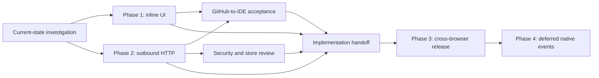

# Outbound Automation Integrations

> **Status: implemented in source on 2026-07-11; manual Chrome/Firefox acceptance
> and store-listing/privacy-policy updates remain release gates.** This folder
> began as an investigation against `b43f2ac`; [current-state.md](./current-state.md)
> is retained as historical baseline, while canonical docs describe current behavior.

This folder answers two related product questions:

1. Can an Automation add UI to a page and react when the user clicks it?
2. How should that action send data from Monocle to a third-party application?

The answer is now **yes**. Automations can insert fixed Monocle-rendered buttons
beside a CSS-selected page element, route a verified click back to a fresh
nested Automation run, and send bounded JSON to a granted loopback or HTTPS
endpoint. Executable action steps stay background-owned.

The implementation:

- extends the existing Surfaces subsystem with a declarative `inline` kind;
- allows that surface to expose fixed, Monocle-rendered click buttons whose
  action definitions remain in the Automation document;
- adds a background-owned `httpRequest` Automation step as the first outbound
  transport;
- allows plaintext HTTP only for exact loopback hosts and requires HTTPS
  everywhere else;
- keeps Chrome and Firefox behavior aligned, including Firefox data-collection
  consent; and
- defers native-bridge event delivery until the inline action and HTTP
  contracts have shipped and stabilized.

No design in this folder permits arbitrary HTML, arbitrary JavaScript, remote
step definitions, page-supplied request URLs, or executable response payloads.

## Reading order

| Document | Purpose |
| --- | --- |
| [current-state.md](./current-state.md) | Verified source-to-sink analysis and the exact gaps at `b43f2ac`. |
| [inline-automation-ui.md](./inline-automation-ui.md) | Shipped selector placement, renderer, action routing, and action-run semantics. |
| [http-request-step.md](./http-request-step.md) | Shipped HTTP schema, execution policy, permissions, response mapping, and editor behavior. |
| [security-and-store-review.md](./security-and-store-review.md) | Threat model and Chrome/Firefox submission implications. |
| [github-to-ide-example.md](./github-to-ide-example.md) | Complete target Automation and local IDE endpoint contract. |
| [implementation-plan.md](./implementation-plan.md) | Executor-ready phases, verification gates, STOP conditions, and status table. |
| [native-bridge-events.md](./native-bridge-events.md) | Deferred paired-client SSE transport, protocol, and daemon changes. |

## Dependency graph

HTTP can be developed independently for manual Automations, but the requested
GitHub control depends on both Phase 1 and Phase 2. Native events depend on the
stabilized action/payload model and are not a prerequisite for the HTTP release.

## Locked decisions

| Decision | Selected behavior | Reason |
| --- | --- | --- |
| Page UI | Fixed click buttons only in v1 | Covers the GitHub-to-IDE use case without adding form state or a markup language. |
| Styling | Closed-shadow, Monocle-owned rendering | Page CSS cannot restyle or impersonate the control. |
| Placement | Static CSS selector plus `before`/`prepend`/`append`/`after` | Reviewable, permission-independent, and sufficient for site augmentation. |
| Visibility | Every tab admitted by the surface URL rules | Matches existing URL-global surface storage and avoids per-tab identity migration. |
| Action values | Fresh run on click | Avoids persisting runtime values or secrets in the surface store. |
| First transport | Background HTTP request | Directly interoperates with IDEs and webhooks without requiring the Monocle Bridge app. |
| HTTP reach | Loopback HTTP plus arbitrary HTTPS | Supports local development while keeping remote transmission encrypted. |
| Response access | Explicit JSON-path-to-string mappings | Preserves the current flat `AutomationValueBag` instead of introducing structured variables. |
| Native events | Deferred authenticated SSE | Unidirectional delivery fits SSE; the current bridge has no subscription or unsolicited-frame path. |
| Automation version | Keep `schemaVersion: 1` | All changes are additive; existing documents remain valid. |

## Recommended execution order

| Phase | Deliverable | Depends on | Status |
| --- | --- | --- | --- |
| 1 | Inline Automation surfaces and safe action entry points | — | IMPLEMENTED; manual browser smoke pending |
| 2 | Outbound HTTP step, grants, consent, and response mappings | Phase 1 | IMPLEMENTED; live endpoint smoke pending |
| 3 | Integrated editor, example, canonical docs, and browser QA | Phases 1–2 | SOURCE/DOCS COMPLETE; manual QA and external disclosures pending |
| 4 | Native-bridge event subscriptions and `sendBridgeEvent` | Phases 1–3 | DEFERRED |

`httpRequest` can execute from a normal Automation independently of inline UI;
the GitHub-to-IDE acceptance path combines both contracts.

## Historical working-tree note

The repository was dirty when this package was written. In particular,
user-owned changes were present in the Automation editor and
`docs/automations.md`. The committed `b43f2ac` editor does not offer
`showSurface`/`hideSurface` in its Add Step selector; the uncommitted worktree
already begins correcting that gap. Every executor must run the drift check in
[implementation-plan.md](./implementation-plan.md), reconcile those changes,
and preserve them rather than reapplying or overwriting them.

## Definition of success

The source implementation is complete and automated/build gates pass. Release
completion still requires a user to import or author the example in
[github-to-ide-example.md](./github-to-ide-example.md), grant only the IDE
endpoint's browser-managed scheme+host pattern, open matching GitHub pages in
multiple Chrome and Firefox tabs, see an isolated button beside the configured
selector, click it, and receive a bounded authenticated JSON request in the IDE.
Revoking the grant,
opening a private tab, returning a redirect, removing/replacing the GitHub
anchor, or supplying an invalid response must fail predictably without leaking
request or response data into logs.
