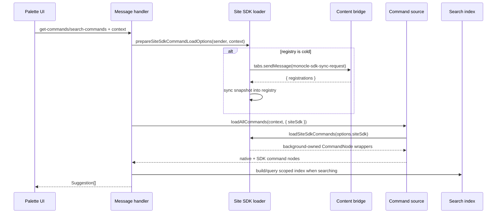
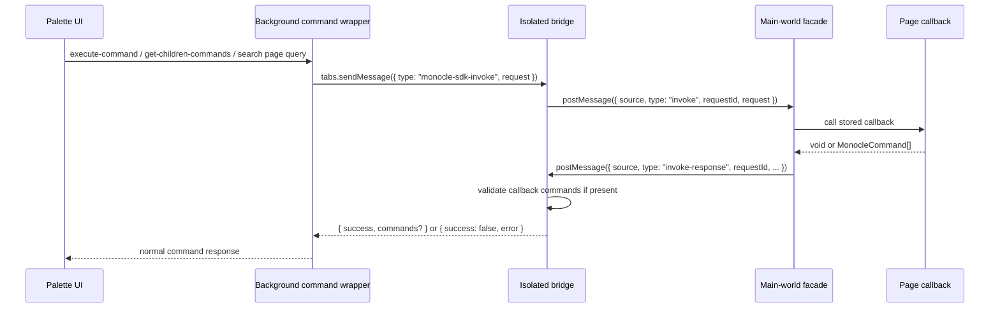

# Site SDK

Monocle exposes a page-world SDK at `window.Monocle` so a site can add
session-only commands to the palette. The SDK is a runtime command source, not a
permissioned plugin system. Site callbacks run in the page, SDK declarations are
validated before the background sees them, and generated background wrappers
behave like normal `CommandNode`s only after that validation boundary.

## Goals and boundaries

The SDK is designed for site-owned, non-privileged commands:

- Commands are registered by the current page/document and are not persisted.
- Commands cannot request extension permissions or call browser APIs through
  Monocle.
- Commands are not keybindable by default; SDK wrappers force
  `allowCustomKeybinding: false`.
- Commands are scoped to the sender tab, top-frame document, origin, and
  namespace.
- The page owns callback functions; the background owns command resolution,
  search, URL filtering, generated actions, favorites, usage, and permission
  checks.

V1 is top-frame only. Subframes are rejected by the sender-derived scope check.

## Runtime files

| Layer | File | Responsibility |
| --- | --- | --- |
| Main-world facade | `entrypoints/site-sdk.content.ts`, `content/siteSdkFacade.ts` | Installs `window.Monocle`, stores page callback functions, serializes registrations, and posts sync/invoke responses. |
| Isolated bridge | `entrypoints/content.tsx`, `content/siteSdkBridge.ts` | Validates page messages, syncs registrations to the background, forwards invoke requests to page callbacks, and refreshes the content palette when registrations change. |
| Shared schema | `shared/types/siteSdk.ts` | Public serialized types, Zod schemas, tree validation, limits, and protocol constants. |
| Background registry | `background/commands/siteSdk/registry.ts`, `scope.ts` | Stores validated registration snapshots by tab/document/origin scope and clears them on navigation/removal. |
| Command wrappers | `background/commands/siteSdk/commands.ts` | Converts serialized SDK declarations into background-owned `CommandNode` wrappers. |
| Message handlers | `background/messages/siteSdkSync.ts`, command/search/execute handlers | Threads sender-scoped SDK options through normal command loading and execution paths. |

## Public API

```ts
const handle = window.Monocle.commands.register({
  namespace: "docs",
  name: "Docs",
  icon: { type: "lucide", name: "BookOpen" },
  commands: [
    {
      id: "open-search",
      type: "action",
      name: "Open Site Search",
      placement: "root",
      actionLabel: "Open",
      onExecute() {
        document.querySelector<HTMLInputElement>("[type='search']")?.focus()
      },
    },
  ],
})

handle.update([
  {
    id: "help",
    type: "display",
    name: "Site help is unavailable",
  },
])

handle.dispose()
```

`register(input)` returns:

```ts
{
  id: string
  update(commands: MonocleCommand[]): void
  dispose(): void
}
```

`namespace` defaults to `default`. Repeated registrations with the same
namespace get session-local ids such as `default`, then `default-2`. The returned
`id` is the registration id used in internal command ids; sites should keep
their public command ids stable across reloads if they want favorites and URL
rules to keep applying.

## Public command schema

```ts
type MonoclePlacement = "site" | "root"

type MonocleCommand =
  | MonocleActionCommand
  | MonocleSubmitCommand
  | MonocleGroupCommand
  | MonocleSearchCommand
  | MonocleInputCommand
  | MonocleDisplayCommand

type MonocleCommandBase = {
  id: string
  name: string | string[]
  description?: string
  icon?:
    | { type: "lucide"; name: IconName }
    | { type: "url"; url: string }
    | { type: "svg"; svg: string }
  color?: ColorName | { preset: ColorName } | { custom: string }
  keywords?: string[]
  executionPayload?: Record<string, string | string[]>
  placement?: MonoclePlacement
  urlRules?: { allowUrls?: string[]; denyUrls?: string[] }
}
```

`IconName` is Monocle's curated Lucide set, not the full Lucide package. It is
intended for generic command concepts such as links, files, users, commerce,
messages, analytics, developer tools, location, and device actions. Use
`{ type: "url" }` for site logos, brand marks, favicons, or imagery that is too
specific for the shared Lucide set, or `{ type: "svg" }` to inline the markup
directly without hosting an image file.

`{ type: "svg" }` accepts raw SVG markup with these constraints
(`validateSvgIconMarkup` in `shared/utils/svg-icon.ts`):

- max 10,000 characters
- exactly one `<svg>...</svg>` root element with no surrounding content
- no `<script>`, `<foreignObject>`, `<iframe>`, `<embed>`, or `<object>`
  elements
- no inline event handlers (`onload=`, `onclick=`, ...) and no `javascript:`
  URLs
- `href` / `xlink:href` may only reference same-document fragments (`#id`),
  so `<use>` and `<image>` cannot load external resources

Monocle renders svg icons exclusively as a static `` data URI — the
markup is never injected inline into the DOM, so even content that slipped
past validation cannot execute scripts, fire event handlers, or fetch
external resources. The validation list above is defense-in-depth, not the
security boundary. One caveat: a host page with a strict `img-src` CSP that
excludes `data:` can block the icon from rendering in the content overlay
(remote `{ type: "url" }` icons have the same class of limitation under
strict `img-src` policies). When image rendering fails, Monocle falls back to a
generic icon.

Supported node families:

| Type | Required fields | Notes |
| --- | --- | --- |
| `action` | `onExecute(event)` | Executable row. Supports `actionLabel`, `modifierActionLabel`, `confirmAction`, `remainOpenOnSelect`. |
| `submit` | `onExecute(event)` | Form submit row. Supports `actionLabel`, `confirmAction`, `remainOpenOnSelect`, `doNotAddToRecents`. |
| `group` | `children` | Static array or callback. SDK groups deep-search by default unless `enableDeepSearch: false`. |
| `search` | `getResults(event)` | Dynamic result page. Optional `onExecute(event)` executes the search node itself. |
| `input` | `field` | Rendered variants only: `text`, `textarea`, `select`, `checkbox`, `switch`, `multi`, `text-list`, `color`. |
| `display` | none beyond base | Non-executable row. |

Not exposed in V1:

- `permissions`
- `supportedBrowsers`
- default `keybinding`
- custom-keybinding fields
- `radio`, `number`, and `record-list` form fields

Unknown fields are rejected because schemas use strict object validation.

## Callback event shapes

Execute callbacks receive:

```ts
type MonocleExecuteEvent = {
  commandId: string
  context: Browser.Context
  values: Record<string, string>
  executionPayload?: Record<string, string | string[]>
}
```

Group child callbacks receive:

```ts
type MonocleResolveEvent = {
  commandId: string
  context: Browser.Context
}
```

Search callbacks receive:

```ts
type MonocleSearchEvent = MonocleResolveEvent & {
  search: string
}
```

Form values are normalized by the background execution path before they reach
the page callback. Multi-value fields arrive as comma-joined strings, matching
the existing command executor compatibility behavior.

## Placement

Root command declarations can choose where they appear:

- Omit `placement` or set `placement: "site"` to put the command under the
  generated site group.
- Set `placement: "root"` to put the command directly in the root empty state
  after Favorites and before native Suggestions.

Nested static commands and callback-returned commands cannot set `placement`.
The bridge and background both validate callback results with
`allowPlacement: false`.

## Data flow: registration

```mermaid
sequenceDiagram
  participant Page as Page JS
  participant Facade as Main-world facade
  participant Bridge as Isolated bridge
  participant Bg as Background registry
  participant Palette as Content palette

  Page->>Facade: window.Monocle.commands.register(input)
  Facade->>Facade: Store callbacks; serialize callback refs
  Facade->>Bridge: window.postMessage({ source, type: "sync", registrations })
  Bridge->>Bridge: validateSiteSdkRegistrations()
  Bridge->>Bg: runtime.sendMessage({ type: "site-sdk-sync", context, registrations })
  Bg->>Bg: derive sender scope; store snapshot; invalidate search index
  Bridge->>Palette: notify local listeners
  Palette->>Bg: get-commands when open/refreshed
```

The sync payload is always the complete registration snapshot. `update()` and
`dispose()` use the same path as initial registration, which keeps the
background registry replace-only rather than patch-based.

## Data flow: command loading and search



The search-index cache key includes the SDK scope and registry revision. SDK
entries use source weight `1.0`, the same as native root commands. SDK groups are
deep-searchable by default unless the public command sets
`enableDeepSearch: false`.

## Data flow: execution, children, and dynamic search



The bridge applies a 3 second timeout to page callback requests. Callback errors
are returned as execution/search/children errors; they are not treated as
successful empty states.

## Internal ids

SDK command declarations keep their public ids, but background wrappers receive
internal ids:

```text
site:<originHash>:<registrationId>:<publicPath>
```

Examples:

```text
site:k9n2xw:docs:open-search
site:k9n2xw:docs:__site-group
site:k9n2xw:docs:__site-group.group-child
```

The origin hash is deterministic but not security-sensitive. The sender-derived
scope, not the hash, is the authority. Internal ids are used for favorites,
usage, generated actions, URL-rule settings, and execution resolution.

## Validation and limits

The SDK validates at two points:

1. The isolated bridge validates every page sync before sending it to the
   background.
2. The bridge and background both validate callback-returned command lists.

Important limits:

| Rule | Limit |
| --- | --- |
| Registrations per snapshot | 20 |
| Commands per registration tree | 100 |
| Maximum static command depth | 5 |
| Command id length | 1-100 |
| Keywords | max 20, each max 80 chars |
| Text fields | max 500 chars unless field-specific |
| URL rule patterns | max 25 per allow/deny list, each max 500 chars |
| SVG icon markup | max 10,000 chars |
| Callback id length | 1-160 |

Validation rejects:

- malformed ids
- duplicate command ids within one registration tree
- duplicate registration ids within a snapshot
- reserved generated-action ids such as `hide-from-domain-*`,
  `hide-command-*`, or `*-enter-action`
- unknown object fields
- unsupported `radio`, `number`, and `record-list` fields
- invalid icon URL protocols; only `http:` and `https:` are allowed
- unsafe svg icon markup; oversize markup, multiple or non-`<svg>` roots,
  script-capable elements, inline event handlers, `javascript:` URLs, and
  non-fragment `href` references are rejected
- invalid URL rule protocols; only `http`, `https`, or `*` are accepted
- nested or callback-returned `placement`

## URL rules and generated actions

SDK commands use the same `urlRules` shape and matching semantics as native
commands:

```ts
urlRules: {
  allowUrls: ["*://docs.example.com/*"],
  denyUrls: ["*://docs.example.com/admin/*"],
}
```

Generated Favorite and Hide from Domain actions are available. Set/Reset
Keybinding actions are omitted because SDK wrappers are not keybindable.

Hide from Domain settings are keyed by internal `site:` command ids. If a site
changes namespace, public command id, or command path, those user settings no
longer match.

## Example: form submit

```ts
window.Monocle.commands.register({
  namespace: "tickets",
  name: "Tickets",
  commands: [
    {
      id: "new-ticket-form",
      type: "group",
      name: "New Ticket",
      children: [
        {
          id: "ticket-title",
          type: "input",
          name: "Title",
          field: {
            id: "title",
            type: "text",
            label: "Title",
            placeholder: "Short summary",
            required: true,
          },
        },
        {
          id: "ticket-priority",
          type: "input",
          name: "Priority",
          field: {
            id: "priority",
            type: "select",
            label: "Priority",
            options: [
              { value: "low", label: "Low" },
              { value: "high", label: "High" },
            ],
            defaultValue: "low",
          },
        },
        {
          id: "ticket-submit",
          type: "submit",
          name: "Create Ticket",
          actionLabel: "Create",
          onExecute({ values }) {
            createTicket({
              title: values.title,
              priority: values.priority,
            })
          },
        },
      ],
    },
  ],
})
```

## Example: dynamic search

```ts
window.Monocle.commands.register({
  namespace: "docs",
  commands: [
    {
      id: "docs-search",
      type: "search",
      name: "Search Docs",
      getResults: async ({ search }) => {
        const results = await searchDocs(search)

        return results.map((result) => ({
          id: `doc-${result.id}`,
          type: "action",
          name: result.title,
          description: result.path,
          icon: { type: "lucide", name: "FileText" },
          executionPayload: { href: result.href },
          onExecute() {
            window.location.assign(result.href)
          },
        }))
      },
    },
  ],
})
```

## Implementation notes

- `window.postMessage` is used only between the main-world facade and isolated
  bridge. Every protocol message carries a source marker:
  `monocle-site-sdk` from page to bridge and `monocle-extension-sdk-bridge` from
  bridge to page.
- The bridge is initialized before `waitForBody()` in `entrypoints/content.tsx`
  so `document_start` registrations can replay before the palette opens.
- `ContentCommandPalette` subscribes to SDK sync changes and calls
  `fetchCommands()` so an open palette can pick up site changes.
- `background/index.ts` clears SDK registry entries on `tabs.onRemoved` and on
  `tabs.onUpdated` URL changes, then invalidates the search index.
- Service-worker resync is best effort. If a tab no longer has a receiving
  content bridge, SDK commands simply do not load for that request.

## Manual checks

Use a fixture page that registers:

- one `placement: "root"` action
- one grouped action
- one submit form with text/select/multi fields
- one dynamic search command
- one callback that throws

In Chrome and Firefox, verify:

- root command ordering: Favorites, root SDK commands, generated site group,
  native suggestions
- generated site group label/icon
- execution and modifier labels
- form value normalization
- dynamic group children and dynamic search results
- callback errors and callback timeout behavior
- root search ranking at native source weight
- Hide from Domain on an SDK command
- SPA URL change or navigation clears/reloads the right registrations
- service-worker restart causes `monocle-sdk-sync-request` and registration
  replay
